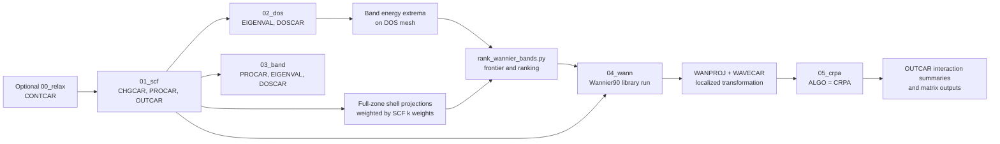

# SCF-to-cRPA physics reference — 1.4.1

## 1. Physical objective

The constrained random-phase approximation (cRPA) supplies effective Coulomb
interactions for a low-energy model. The workflow first represents the chosen
low-energy subspace in a Wannier basis. It then evaluates a partially screened
interaction after excluding screening processes attributed to selected target
Wannier states.

In schematic form, split the independent-particle polarizability into target and
rest contributions:

$$
P(\omega) = P_{\mathrm{target}}(\omega) + P_{\mathrm{rest}}(\omega).
$$

The constrained screened interaction is then formed from the bare Coulomb kernel
$v$ and the remaining polarizability:

$$
W_{\mathrm{rest}}(\omega) =
\left[1 - vP_{\mathrm{rest}}(\omega)\right]^{-1}v.
$$

Matrix elements of $W_{\mathrm{rest}}$ in the chosen Wannier basis define the
frequency-dependent interaction tensor and its commonly reported averages,
including Hubbard $U$ and Hund exchange $J$. This physical interpretation
and the distinction between target and rest screening follow the
[VASP cRPA formalism](https://vasp.at/wiki/CRPA_formalism).

The target space is a scientific choice. A successful job is not evidence that
the orbital projections, energy windows, target-state indices, or convergence
parameters are physically appropriate.

## 2. End-to-end data flow



The base `submit` command creates only the optional relaxation, SCF, DOS, and
band Slurm chain. Wannier and cRPA are prepared and submitted later, after their
required upstream results have been inspected.

## 3. Stage-by-stage process

### 3.1 Optional `00_relax`: establish the structure

**Physical role.** Optimize ionic positions and, with the active `ISIF=3`,
the cell degrees of freedom.

**Input.** Root `POSCAR` and `POTCAR`, plus the generated relaxation `INCAR`.

**Output used downstream.** `CONTCAR`.

**Transfer rule.** Immediately before `01_scf` runs, `crpa-workflow` copies
`00_relax/CONTCAR` to `01_scf/POSCAR`.

**Quality gate.**

- Confirm ionic and electronic convergence, sensible forces and stress, and the
  absence of unphysical structural changes.
- For fixed experimental cells, slabs, or constrained geometries, review
  `ISIF`, selective dynamics, and whether relaxation should be skipped.

The supplied new-case configuration sets `RUN_RELAX=yes`, so plain `prepare`
includes relaxation. Use `--no-relax` for a structure that should be used directly.

### 3.2 `01_scf`: converge the ground-state charge density

**Physical role.** Obtain the self-consistent Kohn-Sham charge density used by
all non-self-consistent downstream stages.

**Important generated settings.**

- `LCHARG = .TRUE.` writes `CHGCAR`.
- `LWAVE = .TRUE.` requests `WAVECAR`.
- `LORBIT = 10` writes projection information needed by later analysis.
- `KPOINTS` is a Gamma-centered mesh generated by VASPKIT task 102, option 2,
  using the configured `KPR_SCF` (0.02 in new-case defaults).

**Outputs consumed later.**

- `CHGCAR` is copied to `02_dos`, `03_band`, and `04_wann`.
- `POSCAR` is copied to those same stages.
- `POTCAR` is also copied to `04_wann`.
- `OUTCAR` supplies the final effective `NBANDS` value used to size the
  Wannier calculation.
- `PROCAR` supplies site/shell projection weights and irreducible-k-point
  integration weights used to rank Wannier target bands. VASP documents these
  fields in its [PROCAR reference](https://vasp.at/wiki/PROCAR); with
  `LORBIT=10`, the values are qualitative PAW-projector weights as described in
  the [LORBIT reference](https://vasp.at/wiki/LORBIT).

**Quality gate.**

- Confirm electronic convergence and inspect the final energy, Fermi level,
  occupations, magnetization, and any DFT+U or spin-orbit behavior.
- Verify that `NBANDS`, k-point density, pseudopotentials, functional, magnetism,
  and symmetry choices match the intended cRPA study.
- Do not rely only on `crpa-workflow status`; it detects a normal VASP timing
  footer, not scientific convergence.

### 3.3 `02_dos`: characterize energies on a uniform mesh

**Physical role.** Perform a non-self-consistent calculation using the SCF
charge density (`ICHARG=11`) on the denser DOS mesh.

**Important generated settings.**

- `ISMEAR=-5` uses the tetrahedron method.
- VASPKIT generates the Gamma-centered mesh using the configured `KPR_DOS` (0.02 in new-case defaults), and
  `NEDOS=2000` is the active energy-grid default.
- `LORBIT=10` makes element/orbital DOS extraction possible.

**Outputs used by this workflow.**

- `EIGENVAL` supplies the minimum and maximum energy of each ranked band over
  the DOS k-mesh.
- `DOSCAR` is used by VASPKIT task 113 and by postprocessing.

**Quality gate.**

- Check that the mesh and smearing are appropriate for the dimensionality and
  metallic character.
- Inspect the orbital-resolved DOS around the intended target manifold.
- Confirm that DOS `EIGENVAL` and SCF `PROCAR` contain the same band count and
  spin layout; preparation validates both before joining their band indices.

### 3.4 `03_band`: identify orbital character along a symmetry path

**Physical role.** Evaluate non-self-consistent bands along a line-mode path
generated by VASPKIT task 303.

**Important generated settings.**

- `ICHARG=11` reuses the SCF charge density.
- `KPOINTS` is copied from the root `KPATH.in`.
- `LORBIT=10` enables `PROCAR` projections.

**Outputs used for plotting.**

- VASPKIT task 213 converts `INCAR`, `POSCAR`, `DOSCAR`, `EIGENVAL`,
  `KPOINTS`, and `PROCAR` into element files named `PBAND_<element>.dat`
  and a `KLABELS` file.
- These PBAND files are used by projected-band/DOS plotting. Wannier ranking
  instead reads the uniform-mesh `01_scf/PROCAR` directly.

VASPKIT documents task 213 as projected band structure by element and task 113
as projected DOS by element in its
[feature list](https://vaspkit.com/features.html) and
[tutorials](https://vaspkit.com/tutorials.html).

**Quality gate.**

- Confirm that the path is appropriate for the actual cell used in the SCF
  calculation.
- Inspect crossings and hybridization. A target described as "d bands" may need
  additional ligand or itinerant orbitals for a faithful Wannier subspace.
- Compare the element- and orbital-resolved plot before choosing
  `--elements` and `--orbitals`; override the inferred `--num-bands` when the
  desired subspace differs from the projection-based default.

### 3.5 Projection ranking: define a frontier, not an explicit band list

For the standalone ranking command and `--window-method legacy`, the ranking score for band $n$ is the normalized
Brillouin-zone projection

$$
S_{n\sigma} =
\frac{\sum_{\mathbf{k}} \omega_{\mathbf{k}}
\sum_{i \in \mathcal{I}} \sum_{l \in \mathcal{L}}
P_{n\mathbf{k}\sigma}^{i,l}}
{\sum_{\mathbf{k}} \omega_{\mathbf{k}}}.
$$

Here, $\omega_{\mathbf{k}}$ is the integration weight written in SCF PROCAR,
$\mathcal{I}$ contains all ions of the requested elements, and $\mathcal{L}$
contains the requested aggregate `s`, `p`, `d`, or `f` shells. Bands are ordered
by decreasing $S_{n\sigma}$. Equal scores are ordered by ascending
band index. For a non-spin calculation, the top `--num-bands` entries are
joined to the same band indices in `02_dos/EIGENVAL`. For a collinear-spin
calculation, the UP and DW SCF PROCAR blocks are ranked independently, so the two
channels may select different band-index sets.

The combined frontier is the smallest and largest DOS-mesh energy among each
channel's selected bands. `prepare_wannier.py` saves only those per-channel
selections in `04_wann/wannier_band_ranking.csv`.

In legacy preparation, if a channel's selected indices are noncontiguous, they are partitioned into
maximal contiguous runs. The run containing the most selected indices drives
that channel's Wannier windows. Equal-length runs are resolved in favor of the
run containing the highest-ranked band. This window choice does not remove
other selected bands, reduce `NUM_WANN`, or change the combined frontier.

Adaptive preparation (the default) instead sums the exact positional pairs:
`--elements Mn Sb --orbitals d p` scores `Mn:d` and `Sb:p` only. Its CSV keeps
the same columns and top-band reporting, but window selection uses individual
SCF states and their own energies, independently of that band-index ranking.
The standalone ranking tool retains the cross-product formula above.
Selected band indices are never written as `exclude_bands`.

### 3.6 `04_wann`: construct the Wannier transformation

**Physical role.** Run the VASP-Wannier90 interface on a uniform Gamma-centered
k-mesh, guided by projections and automatically generated disentanglement
windows.

**Preparation inputs.**

- `01_scf`: non-empty `INCAR`, `POSCAR`, `POTCAR`, `CHGCAR`, `OUTCAR`, and
  shell-resolved `PROCAR`.
- `02_dos`: non-empty `EIGENVAL`.

**Preparation actions.**

1. Rank the requested orbital character.
2. Read the last effective `NBANDS =` value from `01_scf/OUTCAR`.
3. Set Wannier `NBANDS` to twice that value.
4. Generate a Wannier90 k-point path with VASPKIT task 304, option 3.
5. Generate a uniform Gamma-centered `KPOINTS` mesh with VASPKIT task 102,
   option 2, using `KPR_WANN` (default `0.04`) or the `--kpr` override.
6. Clone unrelated SCF INCAR settings and replace the controlled Wannier tags.

**Controlled Wannier settings.**

```text
ICHARG = 11
ISYM = -1
NBANDS = 2 * effective SCF NBANDS
LWRITE_WANPROJ = .TRUE.
LWANNIER90_RUN = .TRUE.
NUM_WANN = --num-bands, or the inferred projection count when omitted
write_hr = true
num_iter = 0
dis_num_iter = 1000
bands_plot = true
bands_num_points = 20
```

`LWANNIER90_RUN` asks VASP to run Wannier90 in library mode. VASP must be
compiled and linked with the appropriate VASP2WANNIER90 support; see the
[VASP Wannier construction guide](https://vasp.at/wiki/Constructing_Wannier_orbitals)
and [`LWANNIER90_RUN`](https://vasp.at/wiki/LWANNIER90_RUN).

`LWRITE_WANPROJ` writes the Wannier transformation matrices used by cRPA.
When `WANPROJ` is present, VASP can read that transformation rather than repeat
Wannierization; see the [WANPROJ specification](https://vasp.at/wiki/WANPROJ).

> **Localization note:** the shipped block uses `num_iter=0`. It performs up to
> 1000 disentanglement iterations but no subsequent Wannier spread-minimization
> iterations. If maximally localized functions are required, that setting is a
> researcher-controlled modification that must be validated.

**Quality gate.**

- Review `wannier_band_ranking.csv`, including the frontier and selected band
  indices.
- Compare original DFT bands with the Wannier-interpolated bands throughout the
  energy range relevant to the model.
- Check the orbital ordering and character of every Wannier state before using
  one-based indices in `NTARGET_STATES`.
- Confirm that `WANPROJ` and `WAVECAR` are non-empty after the run.
- Inspect Wannier90 convergence messages and, if localization is enabled,
  centers and spreads.

### 3.7 `05_crpa`: exclude target screening and obtain interactions

`prepare_crpa.py` accepts only a completed, workflow-owned `04_wann`. It requires
non-empty `POSCAR`, `POTCAR`, `KPOINTS`, `CHGCAR`, `WAVECAR`, `WANPROJ`,
`INCAR`, and `OUTCAR`. The OUTCAR must contain VASP's normal completion marker.
`WAVEDER` is copied only when present and non-empty.

The generated INCAR activates:

```text
ALGO = CRPA
NTARGET_STATES = <one-based Wannier state indices>
NBANDS = <effective completed-Wannier NBANDS>
NBANDSGW = <default NBANDS, or --nbandsgw>
ENCUTGW = <default 2/3 ENCUT, or --encutgw>
ISYM = -1
LMAXMIX = 6
KPAR = <CRPA_KPAR>
```

`NTARGET_STATES` identifies Wannier states whose screening contributions are
excluded. The ordering is basis-dependent, so the indices must be chosen from
the inspected Wannier basis, not guessed from chemical labels. See
[`NTARGET_STATES`](https://vasp.at/wiki/NTARGET_STATES).

The default `ENCUTGW=2/3 ENCUT` follows the VASP response-function default, but
it remains a convergence parameter. Increasing `ENCUTGW` alone is not a complete
basis-convergence strategy; see [`ENCUTGW`](https://vasp.at/wiki/ENCUTGW).
Likewise, high accuracy generally requires `NBANDSGW` to approach `NBANDS`, at
substantial cost; see [`NBANDSGW`](https://vasp.at/wiki/NBANDSGW).

**Reading results.**

- Search `05_crpa/OUTCAR` for screened interaction blocks such as
  `U_iijj`, `U_ijji`, and `U_ijij`.
- Record the averaged screened Hubbard `U`, inter-orbital `u`, and Hund `J`
  reported for the desired frequency.
- Inspect the bare interaction blocks as a screening sanity check.
- Preserve full interaction-matrix outputs such as `UIJKL` and `VIJKL` when
  produced by the installed VASP version and selected options.
- Treat symmetry, Hermiticity, orbital equivalence, frequency dependence, and
  convergence as scientific checks rather than parser output.

The [VASP SrVO3 cRPA example](https://vasp.at/wiki/CRPA_of_SrVO3) illustrates
the OUTCAR summaries and full matrix outputs.

## 4. Exact automated choices

### 4.1 Plane-wave cutoff

When `ENCUT=auto`, the workflow reads every `ENMAX` value from the root
`POTCAR`, takes the largest, multiplies it by `ENCUT_FACTOR` (1.50 in new-case defaults), and rounds
up to the next 5 eV:

$$
\mathrm{ENCUT}=5\,\mathrm{eV}\,
\left\lceil
\frac{f_{\mathrm{ENCUT}}\,\max_i \mathrm{ENMAX}_i}{5\,\mathrm{eV}}
\right\rceil.
$$

Here, $f_{\mathrm{ENCUT}}$ is `ENCUT_FACTOR`, and the ceiling brackets mean
rounding upward to the nearest integer after dividing by 5 eV.

An explicit `ENCUT` in `workflow.conf` bypasses this calculation. An existing
root `POTCAR` is reused; `prepare --force` does not regenerate it.

### 4.2 Disentanglement windows

**Adaptive selection (default).** Read the last finite SCF OUTCAR `E-fermi` and
use one common energy reference. `--search-energy-range MIN MAX` defines the
only search interval relative to this value (default `-20 20`; finite `MIN < MAX`).
The search range and either selected window may lie entirely above or below `E_F`.
There is no separate target interval or search padding. Window keywords are
written in the original absolute energy convention.

For each requested pair, independently at every SCF k-point and spin, sort
the states within the search region by energy and accumulate their PAW weights.
For `--outer-coverage C` (default 0.8), use weighted CDF probabilities
`(1-C)/2` and `(1+C)/2`: the 10th and 90th percentiles by default. Each endpoint
is the first energy where the cumulative fraction reaches its probability.
This uses discrete band weights without smearing or interpolation. Endpoint
states, including degeneracies, are included, so retained weight can exceed C.
Zero-weight distributions are reported as unavailable.

Combine all local intervals using the lowest lower percentile and highest
upper percentile. Round that span outward to the
0.25 eV grid anchored at `E_F`, including exact search endpoints. If state
counts require it, choose the narrowest further expansion containing at least
`NUM_WANN` states at every SCF and DOS k-point. Ties prefer balance about `E_F`,
then the lower lower-bound. Zero-width windows are expanded to positive width.
If no expansion passes, preparation stops; it never silently enlarges the
search region. The percentile span is never trimmed to satisfy counts.

This replaces the shortest interval containing C of the local weight, which
could discard nearly all of the allowed weight from one tail. Separate tail
limits may give a wider window and do not guarantee avoiding the search ceiling.

Frozen bounds are searched across the full outer interval in 0.25 eV steps
inward from each outer edge, including exact outer endpoints. After applying
`--frozen-margin` (default 0.1 eV), the interval must have positive width, contain no
SCF state whose requested-pair weight divided by total PAW weight is below
`--frozen-character-min` (default 0.70), and have at most `NUM_WANN` states at
every SCF/DOS k-point. Zero-total-weight states are ineligible. There must be
at least one frozen SCF state in each spin channel. The winner maximizes
k-weighted requested orbital weight (normalized per spin); ties prefer greater width,
then the lower lower-bound. Degenerate states are counted together.
If no candidate passes, both `dis_froz_*` keywords are omitted: the result is
an explicitly reported outer-only calculation.

Neither window is required to contain `E_F`. Both windows can be asymmetric.
The outer window can be narrower than the
former ±2 eV target, and the inner window can extend beyond those former
bounds. A positive margin removes outer-edge states from frozen candidates;
if no candidate retains states in every spin channel, the result is outer-only.

The per-pair coverage denominator excludes bands outside the bounded region,
so adding distant high-energy bands does not move the adaptive windows.
PAW fractions are qualitative character estimates, not normalized Wannier
projectabilities or radial-shell identifiers. The method does not prove band
interpolation accuracy. SCF weights are never attached to DOS k-points; the
two meshes receive independent count checks. The generated Wannier mesh
remains unverified. No Wannier runs or automatic model-dimension changes occur.

**Legacy selection (`--window-method legacy`).**

For each spin channel, partition the rank-ordered target-band indices into
maximal contiguous runs and choose the run with the most indices. If runs have
the same length, choose the one containing the highest-ranked band. Let
$E_{\min}$ and $E_{\max}$ be the union envelope of these independently chosen
UP/DW window bands in `02_dos/EIGENVAL`. For each channel, find the highest
energy among bands below its chosen run and the lowest energy among bands above
it. Let $G_{\mathrm{lower}}$ be the larger of the available lower guards and
$G_{\mathrm{upper}}$ the smaller of the available upper guards. A missing guard
at an EIGENVAL edge leaves that side unbounded.

| Window | Lower bound | Upper bound |
|---|---:|---:|
| Outer (`dis_win`) | $E_{\min}-5.0$ eV | $E_{\max}+5.0$ eV |
| Frozen candidate | $\max(E_{\min},G_{\mathrm{lower}})$ | $\min(E_{\max},G_{\mathrm{upper}})$ |
| Frozen (`dis_froz`) | candidate minimum + `--frozen-margin` | candidate maximum - `--frozen-margin` |

The margin defaults to 0.1 eV. Preparation fails if the shrunken interval is
empty, contains a band outside the chosen run, or contains more than
`NUM_WANN` states at any EIGENVAL k-point in either spin channel. Selected
ranked bands outside the chosen run remain in the ranking CSV and count toward
`NUM_WANN`, but are outside the window-driving target block. In Wannier90, the
outer window provides candidate states while the frozen manifold is retained
in the optimized subspace; the parameters are documented in the
[Wannier90 parameter reference](https://www.wannier.org/ford/module/w90_parameters.html).

Both methods now reject outer windows containing fewer than `NUM_WANN` states
at any supplied SCF or DOS k-point; this can reject previously accepted legacy
inputs. `04_wann/wannier_window_diagnostics.json` records the method, sources,
parameters, projection pairs, windows, limiting count locations and validation
scope. Adaptive reports additionally include the Fermi reference, relative
windows, minimum coverage per pair, unavailable distributions, rejected frozen
candidate counts, low-character states in the search region, band-edge warnings and any
outer-only explanation. `outer_selection` identifies `local_equal_tail_quantiles`;
`outer_quantiles` records local percentile endpoints, their combined span,
the rounded grid span (`rounded_grid_relative`), and state-count/nonzero-width
expansion flags. Frozen rejections use `margin_or_width` for invalid shrunken
intervals; there is no Fermi-containment rejection.
Reaching a search/band boundary is reported and is
not evidence of `NBANDS` convergence.

### 4.3 Band counts

- SCF `NBANDS` is chosen by VASP unless the templates are changed.
- Wannier `NBANDS` is exactly twice the last effective SCF OUTCAR value.
- `NUM_WANN` is the requested `--num-bands`, or by default the sum of each
  paired element's atom count times its orbital multiplicity.
- `NUM_WANN` must not exceed the doubled SCF `NBANDS`.
- cRPA `NBANDS` is the last effective value from completed `04_wann/OUTCAR`.
- cRPA `NBANDSGW` defaults to that value and may not exceed it.

### 4.4 Stage ownership and refresh semantics

Generated stage directories contain `.generated-by-poscar-workflow`.
`crpa-workflow` refuses to overwrite a stage lacking that marker.

For `00_relax` through `03_band`, `prepare --force` refreshes generated inputs
in place. It does not delete old `OUTCAR`, `WAVECAR`, `CHGCAR`, or scheduler
logs. Archive or remove stale outputs deliberately before rerunning.

For `04_wann` and `05_crpa`, the Python preparers build a complete temporary
stage and replace only an existing workflow-owned stage when `--force` is used.

## 5. Researcher quality gates

### 5.1 Before SCF

- Confirm POSCAR species order, cell, constraints, dimensionality, and magnetic
  initialization.
- Confirm POTCAR choices, including semicore or GW variants where appropriate.
- Set the functional, DFT+U, magnetism, SOC, smearing, and symmetry consistently.
- Converge `ENCUT` and k-point density for the desired observables.

### 5.2 Before Wannier preparation

- Verify that SCF, DOS, and band runs used compatible structures, potentials,
  spin treatment, and band indexing.
- Plot projected bands and DOS.
- Choose a basis large enough to reproduce hybridized target bands.
- Use `rank_wannier_bands.py` interactively to inspect several candidate
  `--num-bands` choices instead of accepting one ranking blindly.
- Check that the automatic frozen and outer windows contain the intended
  manifold at every k-point.

### 5.3 Before cRPA preparation

- Compare DFT and Wannier-interpolated bands.
- Identify the one-based ordering of target Wannier states.
- Decide whether all Wannier states or only a subset belong to the correlated
  model.
- Preserve the completed `04_wann` inputs and outputs used to generate
  `05_crpa`.

### 5.4 cRPA convergence program

At minimum, test sensitivity to:

- Uniform Wannier/cRPA k-mesh (`--kpr`).
- SCF and Wannier `NBANDS`, including empty states.
- `NBANDSGW`.
- `ENCUT` and `ENCUTGW` together.
- Projection set, `NUM_WANN`, and disentanglement windows.
- Presence and treatment of `WAVEDER`.
- Smearing, spin/SOC, symmetry, and the cRPA method available in the installed
  VASP version.

Report the VASP version, pseudopotentials, target basis, target-state indices,
all convergence parameters, and whether quoted values are static or
frequency-dependent.

## 6. Version-sensitive cautions

### 6.1 Default projector cRPA versus spectral cRPA

The supplied `INCAR_CRPA_TEMPLATE` sets `ALGO=CRPA` and does not set `LSCRPA`;
therefore it uses VASP's default projector-cRPA path. Current VASP 6.6
documentation recommends spectral cRPA for new calculations. The active
`SBATCH_TEMPLATE`, however, sources an environment named `vasp651_env.sh`.
Do not add VASP 6.6-only guidance to a VASP 6.5.1 job without checking
compatibility and reproducing validation.

### 6.2 `WAVEDER` is conditional, not automatically beneficial

`prepare_crpa.py` copies `WAVEDER` if it exists and otherwise emits a warning
while still preparing the stage. Current VASP documentation notes a
projector-cRPA long-wave caveat for which deleting `WAVEDER` may improve
k-point convergence in affected cases. Other cRPA methods can have different
recommendations. Treat the file as a method- and version-dependent scientific
choice.

### 6.3 Script completion is not physical validation

The automation validates files, indices, layouts, and ownership. It does not
validate:

- whether target orbitals are localized enough;
- whether the target space reproduces the DFT bands;
- whether the automatic energy windows are optimal;
- whether the interaction is converged;
- whether the chosen cRPA method is suitable for the installed VASP version.
