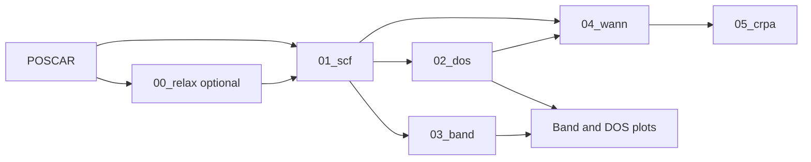

# crpa-workflow — User Manual

[中文版用户手册](user_manual_zh.md)

**Software version:** 1.0.0 (candidate)\
**Document status:** Draft for review, 2026-09-11\
**Intended audience:** Researchers preparing VASP calculations on Linux systems\
**Registration name and copyright holder:** To be confirmed by the applicant

## Contents

1. Purpose and functions
2. Operating environment and installation
3. Configuration and calculation directories
4. First calculation
5. Command reference
6. Wannier and cRPA operations
7. Batch processing
8. Inputs, outputs and status
9. Errors, recovery and scientific verification
10. Demonstration and validation record

## 1. Purpose and functions

The software prepares and manages a sequence of VASP calculations: optional
structural relaxation, self-consistent field (SCF), density of states (DOS), band
structure, Wannier construction and constrained random-phase approximation (cRPA).
It generates input files and job scripts, submits dependent Slurm jobs, reports
file-based stage status, analyzes orbital projections, proposes Wannier energy
windows and plots projected band structures and DOS.

VASP performs the electronic-structure calculations. The workflow organizes these
calculations and processes their inputs and outputs. VASPKIT supplies meshes,
paths, pseudopotential assembly and selected projection exports.



The base Slurm pipeline ends at DOS and bands. Wannier and cRPA require separate
preparation and submission after inspecting prerequisite calculations.

## 2. Operating environment and installation

Use Linux, Bash 4+, Python 3.10+, standard Unix tools and a configured VASP/VASPKIT
installation. Plotting requires NumPy and Matplotlib. Submission requires Slurm.
Wannier and cRPA operations require a compatible VASP build with the necessary
capabilities and restart outputs. Use WSL or a remote Linux cluster from Windows.

The workflow itself has modest resource requirements; VASP memory, disk and CPU
needs depend on the material, k mesh, bands and selected method. Select and record
resources for the actual calculation rather than treating example settings as
universal requirements.

From a complete source distribution:

```bash
bash install.sh "$HOME/.local/share/crpa-workflow/1.0.0"
source "$HOME/.local/share/crpa-workflow/1.0.0/bin/activate"
crpa-workflow --version
```

See [Installation](installation.md) for existing environments, offline installation
and troubleshooting. Installation does not include VASP executables or pseudopotentials.

## 3. Configuration and calculation directories

Install the software once. Each material has its own calculation directory with
`POSCAR`, `workflow.conf` and generated stage directories. It does not need a copy
of the software source. An existing `POTCAR` can be supplied; otherwise configure
VASPKIT to generate it from an appropriate pseudopotential library.

```bash
crpa-workflow init my-material --poscar /path/to/POSCAR --profile slurm
cd my-material
```

The input must use VASP 5-style element symbols on line 6. Initialization refuses
to overwrite its existing configuration, metadata or supplied POSCAR destination.
The local profile uses `vasp_std`; the Slurm profile uses `srun vasp_std`.

Edit the following settings before preparing:

| Setting | Meaning |
| --- | --- |
| `VASPKIT_BIN` | VASPKIT executable name or absolute path |
| `PYTHON_BIN` | Optional Python executable override; normally use the installation environment |
| `EXECUTION_SETUP` | Module/environment commands included in direct execution and generated jobs |
| `STAGE_COMMANDS` | Default and optional per-stage execution commands |
| `SBATCH_PARTITION`, `SBATCH_EXTRA` | Partition and optional account/QoS directives |
| `SBATCH_NODES`, `SBATCH_NTASKS_PER_NODE` | Node and task counts |
| `SBATCH_CPUS_PER_TASK`, `SBATCH_TIME` | CPU allocation and wall-time limit |
| `CRPA_SBATCH_*`, `CRPA_KPAR` | Optional cRPA resource overrides |
| `RUN_RELAX`, `GENERATE_BANDS` | Enable relaxation and band stages |
| `ENCUT`, `ENCUT_FACTOR` | Fixed plane-wave cutoff or factor applied to maximum POTCAR ENMAX |
| `KPR_RELAX`, `KPR_SCF`, `KPR_DOS`, `KPR_WANN` | Mesh-generation resolutions |
| `INCAR_*_TEMPLATE`, `SBATCH_TEMPLATE` | Full input/job templates |

For newly initialized cases, the supplied scientific defaults are `ENCUT=auto`,
`ENCUT_FACTOR=1.50`, `EDIFF=1e-6`, `EDIFFG=-0.02`, `ISIF=3`, `NSW=200`,
`KPR_RELAX=0.03`, `KPR_SCF=0.02`, `KPR_DOS=0.02`, `KPR_WANN=0.04`,
`NEDOS=2000`, `RUN_RELAX=yes` and `GENERATE_BANDS=yes`. The cutoff is rounded
up to a multiple of 5 eV. These preserve the current research configuration's
scientific choices; they require convergence checks for each material.

Global `--config FILE` selects an explicit configuration. Otherwise commands use
`WORKFLOW_CONFIG` if set, or the case's `workflow.conf`. See the installation guide
for precedence and the distinct historical fallback defaults when variables are absent.

## 4. First calculation

Use the supplied `examples/silicon/POSCAR` as a small input-format demonstration.
It is not a validated reference calculation.

```bash
crpa-workflow init silicon --poscar examples/silicon/POSCAR --profile slurm
cd silicon
# Edit workflow.conf for the cluster and calculation.
crpa-workflow doctor prepare
crpa-workflow prepare --no-relax
crpa-workflow doctor submit
crpa-workflow submit --job-name silicon
crpa-workflow status
```

`prepare --no-relax` generates `01_scf`, `02_dos` and `03_band` using the supplied
structure. Omit `--no-relax` when relaxation is desired. With relaxation enabled,
SCF consumes its completed `CONTCAR`; DOS and bands consume SCF's charge density.
Slurm submissions use `afterok` dependencies: relaxation → SCF → DOS/bands.

On a direct-execution system, initialize with `--profile local`, configure the
execution command and use `crpa-workflow run` after preparation. Direct execution
runs sequentially and occupies the current session. Follow your site's rules about
where calculations may run.

## 5. Command reference

Global options precede the command:

```bash
crpa-workflow --root /path/to/case --config /path/to/custom.conf prepare
```

| Command | Function and main options |
| --- | --- |
| `--help`, `--version` | List installed commands or print the software version |
| `init DIR --poscar FILE --profile local\|slurm` | Initialize a case; profile defaults to Slurm |
| `doctor prepare\|plot\|submit\|run` | Check current-shell prerequisites; default mode is prepare |
| `prepare [--no-relax] [--force]` | Generate base stages and their inputs/jobs |
| `run` | Execute prepared base stages sequentially |
| `submit [--job-name PREFIX]` | Submit the base dependency pipeline |
| `execute STAGE` | Execute one prepared stage directly |
| `status` | Report prepared/output state for registered stages |
| `postprocess [OPTIONS]` | Generate projected band/DOS figures |
| `rank-bands --elements E... --orbitals O...` | Rank bands by weighted orbital projections |
| `prepare-wannier [OPTIONS]` | Prepare `04_wann` from completed upstream data |
| `run-wannier`, `submit-wannier` | Execute or submit the prepared Wannier stage |
| `prepare-crpa [OPTIONS]` | Prepare `05_crpa` from completed Wannier data |
| `run-crpa`, `submit-crpa` | Execute or submit the prepared cRPA stage |
| `batch [OPTIONS] STRUCTURE_DIR [CALCULATION_DIR]` | Prepare and optionally run/submit multiple structures |

`submit-wannier` and `submit-crpa` accept `--job-name PREFIX`. Generated job scripts
are self-contained and can be submitted inside a stage using `sbatch job.sh`.
Independent submission requires the user to ensure prerequisite jobs have finished
or set an appropriate scheduler dependency.

`doctor` reports found/missing commands, Python and optional plotting dependencies,
checks POSCAR presence for preparation and basic Slurm resource counts for submission.
It does not run simulation commands or establish physical convergence.

For detailed plotting and scientific command options, see the
[command quick guide](quickstart.md) and each command's `--help` output.

## 6. Wannier and cRPA operations

After SCF, DOS and the requested band calculation complete:

```bash
crpa-workflow postprocess --elements Si --emin -5 --emax 5
crpa-workflow prepare-wannier --elements Si Si --orbitals s p
```

Elements and orbitals in Wannier preparation are paired by position: here `Si:s`
and `Si:p`. `NUM_WANN` defaults to atom counts multiplied by shell multiplicities
(`s=1`, `p=3`, `d=5`, `f=7`); `--num-bands` overrides it. Choose the target subspace
and number of bands for the physical problem.

Adaptive selection is the default. `--search-energy-range MIN MAX` defaults to
`-20 20` eV relative to the finite SCF Fermi energy. `--outer-coverage` defaults
to `0.8`; `--frozen-character-min` defaults to `0.70`. Neither selected window
has to include the Fermi level. An outer-only result is possible when no acceptable
frozen interval exists. `--window-method legacy` selects the prior formulas.

Inspect `04_wann/wannier_window_diagnostics.json`, the generated input and the
chosen orbital subspace before submission:

```bash
crpa-workflow submit-wannier --job-name silicon
# Wait for completion; inspect localization and interpolated bands.
crpa-workflow prepare-crpa --target-states 1-8
crpa-workflow submit-crpa --job-name silicon
```

The target-state range is an illustration for the eight Wannier functions inferred
from this two-atom Si `s,p` example. Use indices appropriate to your calculation.
By default cRPA preparation selects all Wannier states. Individual indices and
inclusive ranges may be combined. `--nbandsgw` and `--encutgw` override defaults
of the effective Wannier band count and two-thirds of the plane-wave cutoff.

Preparation checks supplied SCF/DOS meshes; it does not prove the quality of the
actual Wannier mesh, localization, interpolation or cRPA convergence.

## 7. Batch processing

Inputs can be flat `POSCAR*`, `*.vasp` or `*.poscar` files, or nested folders
containing `POSCAR`. Supply a reviewed configuration explicitly:

```bash
crpa-workflow --config /path/to/workflow.conf batch \
  --dry-run --mode prepare /path/to/structures /path/to/calculations
crpa-workflow --config /path/to/workflow.conf batch \
  --mode prepare /path/to/structures /path/to/calculations
```

The dry run lists the mapping without creating calculations. Batch mode defaults
to `submit`; specify `--mode prepare` to generate inputs for review first.
`--mode run` executes directly. `--no-relax` skips relaxation.

Each case contains its POSCAR, a configuration copy, a small `workflow.sh` launcher,
version metadata and generated stages. The launcher refers to the installation
that created it; retain that installation or invoke a different installed release
explicitly with `crpa-workflow --root CASE`.

Existing cases are skipped by default. `--force` refreshes batch-owned cases, but
cases with a changed POSCAR or without the batch ownership marker are skipped.
Failures are counted while other cases continue; any failure gives a nonzero exit
status. A final summary reports prepared, completed, skipped and failed counts.

## 8. Inputs, outputs and status

| Location | Main contents |
| --- | --- |
| Case root | POSCAR, POTCAR, workflow.conf, stage registry and creation metadata |
| `00_relax` | Generated relaxation inputs; completed CONTCAR used for SCF |
| `01_scf` | SCF inputs and outputs including CHGCAR, PROCAR and OUTCAR |
| `02_dos` | DOS inputs/outputs including EIGENVAL and DOSCAR |
| `03_band` | Band-path inputs, projections and energy outputs |
| `04_wann` | Wannier inputs, diagnostics, restart data and Wannier outputs |
| `05_crpa` | cRPA inputs, restart data and interaction calculation outputs |
| `projected_band_dos.*` | Default projected band/DOS figure names |

`status` reports `prepared` for a registered stage, `started` when OUTCAR exists,
and `finished` when it contains the expected VASP timing/accounting footer.
This is file-based status, not a query of Slurm and not a convergence certificate.
Use the scheduler and logs to determine queued, running or failed job states.

## 9. Errors, recovery and scientific verification

| Symptom | Likely cause and action |
| --- | --- |
| Missing POSCAR | Select the correct root and supply a nonempty VASP 5-style file. |
| Missing VASPKIT | Load the module in the current shell or correct `VASPKIT_BIN`. |
| POTCAR generation fails | Check species names and the configured pseudopotential library. |
| Submission fails | Inspect partition/account limits, resources, Slurm availability and error output. |
| Upstream CHGCAR/CONTCAR missing | Complete the upstream stage and inspect its logs before running the dependent stage. |
| Stage directory already exists | Inspect the existing calculation; use a new directory or intentional `--force`. |
| Wannier selection rejected | Check upstream files, orbital pairing, band counts and diagnostic messages. |
| cRPA target index rejected | Use indices within the completed Wannier basis size. |
| Configuration edits have no effect on jobs | Existing jobs retain captured settings; regenerate only when it is safe to replace inputs. |

Preserve calculation results before deliberate regeneration. The workflow provides
no universal failed-job restart or automatic convergence recovery. Diagnose the
VASP failure and choose restart settings appropriate to that stage.

Check relaxation forces/stress, electronic convergence, k-mesh/cutoff convergence,
projection suitability, Wannier spreads and interpolation, and cRPA convergence.
See [Physics reference](physics_reference.md) for the calculation rationale.

## 10. Demonstration and validation record

The supplied silicon structure demonstrates input format. Mock integration tests
exercise preparation and submission without VASP. They do not produce physical
reference results. The projected plotting fixture contains test data rather than
a converged material calculation.

Before final registration, add actual terminal captures and plots from an approved,
completed case: installation/version, configuration, preparation, submission/status,
projected bands/DOS, Wannier diagnostics and cRPA outputs. Record the cluster,
software/build versions and calculation settings. The applicant must confirm the
official software name, copyright holder, completion date and registration version.


### Execution and restart validation (2026-09-12)

Submit generated jobs from their stage directory (`cd STAGE && sbatch job.sh`).
Slurm jobs resolve their stage using `SLURM_SUBMIT_DIR` and require the workflow
ownership marker; direct Bash execution resolves the script location. Regenerate
existing job scripts after updating the package to obtain these fixes.

Help for execution commands performs no calculation, and unexpected arguments
are rejected. Runtime setup and custom commands use `set -euo pipefail` in the
child login shell. A failed setup, simple command or pipeline stops the job;
custom shell code that explicitly handles failures remains responsible for its
own exit semantics. `postprocess` uses configured `VASPKIT_BIN`, with an explicit
`--vaspkit` argument taking precedence.

Failed forced Wannier installation restores the previous stage. If filesystem
errors also prevent rollback, the previous tree remains in the preparation
temporary directory (`previous-04_wann`) for recovery; do not remove it before
recovering data. Successful force replacement still discards old Wannier results.

cRPA preparation supports the documented whitespace-separated text WANPROJ
format, not the HDF5 representation. It checks dimensions against INCAR/effective
OUTCAR NBANDS (and OUTCAR NKPTS when present), the k-point table, all spin/k-point
blocks, complete band/orbital index coverage and finite matrix entries. It does
not prove matrix orthonormality, physical compatibility or scientific convergence.
Format reference: https://vasp.at/wiki/WANPROJ .
