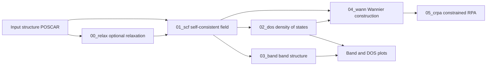

# Automatic Wannier Energy Window Selection and cRPA Workflow Software — User Manual

**Software version:** V1.1.0 (candidate; technical project: crpa-workflow 1.1.0)\
**Document status:** Draft for review\
**Document updated:** 2026-09-17\
**Intended audience:** Researchers running VASP calculations on Linux workstations or high-performance computing clusters

This manual describes installation, configuration, automatic window selection, stage submission and result inspection. Chapter 4 uses the γ-Ce command record, configuration, Wannier input, window diagnostics and three result images supplied by the case provider to illustrate the procedure, including actual window values and cRPA output. Commands, filenames and parameter names retain their program spelling.

[中文版用户手册](user_manual_zh.md)

## Contents

1. Software overview
2. Operating environment and installation
3. Calculation directories and configuration
4. γ-Ce worked example
5. Command reference
6. Band/DOS plotting and band ranking
7. Wannier and cRPA calculations
8. Batch processing
9. Inputs, outputs and status
10. Common problems and recovery
11. Scientific checks and validation scope

## 1. Software overview

### 1.1 Purpose

The software's technical project name is crpa-workflow. Its central function is to select Wannier energy windows automatically from target-orbital projections and band data, and to manage the stages from prerequisite electronic-structure calculations through Wannier construction to constrained random-phase approximation (cRPA) calculations.

Window selection takes the target orbitals, search range and constraint parameters as input. It generates an outer window and, when the constraints allow, a frozen window, together with diagnostics and Wannier input. Workflow control covers input preparation, data transfer, execution, job submission and file-based status for optional structural relaxation, self-consistent field (SCF), density of states (DOS), band structure, Wannier and cRPA stages.

The software generates input files and job scripts, arranges data transfer between stages, submits Slurm jobs with dependencies, reports calculation status from output files, analyzes orbital projections, selects Wannier energy windows and plots bands/DOS.

VASP performs the electronic-structure calculations. VASPKIT supplies selected meshes, band paths, pseudopotential assembly and projection data. Users must provide these external programs and their runtime environments separately.

### 1.2 Functions

| Function | Description |
| --- | --- |
| Automatic Wannier window selection | Select outer and feasible frozen windows using target-orbital projections, local weight coverage and state-count constraints; generate diagnostics |
| Case initialization | Create an independent material directory and configuration |
| Environment checks | Check tools, Python and selected input conditions in the current shell |
| Base-stage preparation | Generate relaxation, SCF, DOS and band inputs and jobs |
| Execution and submission | Support sequential direct execution and Slurm dependency submissions |
| Status reporting | Report stages using the stage registry and OUTCAR files |
| Projection analysis and plotting | Plot element/orbital-projected bands and DOS, with optional Wannier band overlays |
| Wannier preparation | Generate Wannier input and window diagnostics from orbital choices and existing calculation data |
| cRPA preparation | Generate cRPA input from completed Wannier data and validate target-state indices |
| Batch processing | Create independent directories for multiple structures and prepare, run or submit each case |

### 1.3 Calculation flow



The base `submit` command submits optional relaxation, SCF, DOS and bands. DOS and bands both depend on SCF, with no dependency between each other. Wannier and cRPA require separate preparation and submission after inspecting prerequisite results.

## 2. Operating environment and installation

### 2.1 Requirements

| Component | Requirement or purpose |
| --- | --- |
| Operating system | Linux; Windows users can install/run in WSL or connect to a remote Linux cluster |
| Shell | Bash 4 or newer and standard Unix command-line tools |
| Python | Python 3.10 or newer |
| Installation components | The installer needs `venv` and either `ensurepip` or an existing pip supporting `--python` |
| VASP | A separately configured executable with the required calculation capabilities |
| VASPKIT | A separately configured installation and, where needed, an accessible pseudopotential library |
| Wannier/cRPA support | A VASP build and runtime components supporting the intended Wannier and cRPA calculations |
| Slurm | Required for `submit` commands; not required for direct execution |
| NumPy, Matplotlib | Plotting dependencies, installed with the `plot` extra |

The software does not include VASP executables or pseudopotentials. Installing the workflow does not configure external simulation programs. Native Windows does not support the Bash calculation workflow; use WSL or Linux.

CPU, memory and disk requirements depend on atom count, k points, bands and calculation method. Assess resources for the actual material; the example resource requests are not universal production settings.

The case provider reported testing the example on a remote Linux cluster with VASP 6.5.1 and VASPKIT 1.5.1. The supplied environment report records CentOS Linux 7, Python 3.13.5, Bash 4.2.46 and Slurm 19.05.7; these describe the session when the report was collected. Case settings appear in Chapter 4. Development used Windows, VS Code and WSL Ubuntu.

### 2.2 Using the installation script

Extract the complete source distribution and run from the directory containing `install.sh`:

```bash
bash install.sh "$HOME/.local/share/crpa-workflow/1.1.0"
source "$HOME/.local/share/crpa-workflow/1.1.0/bin/activate"
crpa-workflow --version
```

The last command normally prints `crpa-workflow 1.1.0`. The installer places the software and plotting dependencies in the specified Python virtual environment. It requires no administrator privileges and does not modify shell startup files.

The installer refuses to overwrite an existing target directory. Use a new directory when upgrading and retain the old environment for batch launchers that reference it. Activate the environment in each new terminal, or invoke the installed command by its absolute path.

### 2.3 Installing in an existing Python environment

From the source directory:

```bash
python -m pip install '.[plot]'
```

The `plot` extra installs NumPy and Matplotlib. Omit it if only preparing calculation files:

```bash
python -m pip install .
```

For development and debugging, use `python -m pip install -e '.[plot]'`. Ordinary users should install an explicitly versioned release.

### 2.4 Command-name migration

The former `vasp-workflow` and `vasp-workflow-batch` commands are now `crpa-workflow` and `crpa-workflow-batch`. The Python module is `crpa_workflow` and the pip package is `crpa-workflow`. This version provides no aliases for the old commands, and existing installations are not renamed automatically. Install the new source in a new environment and activate it.

The command rename alone does not require changes to existing case directories, generated `job.sh` files or scientific inputs. Old batch launchers still reference `vasp_workflow`: retain their original environment or manage existing cases from the new environment using `crpa-workflow --root /path/to/case COMMAND`. To obtain the separate execution fixes described in Chapter 11, regenerate existing job scripts. The legacy ZIP backup retains historical names.

### 2.5 Offline installation

On an internet-connected Linux system matching the target cluster's Python version and CPU architecture, build wheels from the source directory:

```bash
python -m pip wheel '.[plot]' 'setuptools>=68' -w wheelhouse
```

Copy `wheelhouse` to the cluster and run in a Python environment that already has pip:

```bash
python -m pip install --no-index --find-links wheelhouse \
  'crpa-workflow[plot]==1.1.0'
```

If the cluster's Python lacks installation components, select an appropriate cluster-provided Python environment first. See the [installation guide](installation.md) for details.

## 3. Calculation directories and configuration

### 3.1 Creating an independent case

Install the software once and use a separate directory for each material:

```bash
crpa-workflow init my-material --poscar /path/to/POSCAR --profile slurm
cd my-material
```

Replace `/path/to/POSCAR` with the actual input path. The input must use VASP 5-style element symbols on line 6. Initialization writes `workflow.conf` and version metadata, and copies the structure when `--poscar` is supplied.

Initialization refuses to overwrite existing configuration, initialization metadata or the destination POSCAR. It creates the case without starting VASP. The case directory does not need a copy of the source code. Supply an existing `POTCAR`, or configure VASPKIT to generate it from an appropriate pseudopotential library.

`--profile` supports two modes:

| Profile | Default execution command | Use |
| --- | --- | --- |
| `slurm` | `srun vasp_std` | Slurm clusters; the initialization default |
| `local` | `vasp_std` | Direct execution in an appropriate computing environment; an MPI command can be configured |

New Slurm configurations request one node and one task per node, with an empty partition. Adjust the partition, account, task counts and environment for the cluster before running.

### 3.2 Main configuration settings

`workflow.conf` uses Bash syntax and supports variables, execution commands and complete templates. Use configurations from trusted sources and check syntax and settings after editing.

| Setting | Purpose |
| --- | --- |
| `VASPKIT_BIN` | VASPKIT executable name or absolute path |
| `PYTHON_BIN` | Optional Python executable override; normally use the installation environment |
| `SUBMIT_COMMAND` | Submission command; defaults to `sbatch` |
| `EXECUTION_SETUP` | Module/environment commands for direct execution and generated jobs |
| `STAGE_COMMANDS` | Default and optional per-stage execution commands |
| `SBATCH_PARTITION` | Slurm partition |
| `SBATCH_NODES`, `SBATCH_NTASKS_PER_NODE` | Node and task counts |
| `SBATCH_CPUS_PER_TASK`, `SBATCH_TIME` | CPUs per task and wall-time limit |
| `SBATCH_EXTRA` | Additional Slurm directives, such as account or QoS |
| `CRPA_SBATCH_*`, `CRPA_KPAR` | cRPA resource overrides and KPAR |
| `RUN_RELAX`, `GENERATE_BANDS` | Enable relaxation and band-stage preparation |
| `ENCUT`, `ENCUT_FACTOR` | Fixed plane-wave cutoff or multiplier for automatic selection from POTCAR ENMAX |
| `KPR_RELAX`, `KPR_SCF`, `KPR_DOS`, `KPR_WANN` | Mesh-generation resolutions for each stage |
| `INCAR_*_TEMPLATE`, `SBATCH_TEMPLATE` | Complete INCAR templates and job-header template |

Tools needed during preparation, including VASPKIT, must be available in the current shell. `EXECUTION_SETUP` applies to calculation execution and generated jobs; `doctor` does not execute it.

### 3.3 Main defaults for new cases

These values apply to configurations generated by `init` without a custom configuration:

| Parameter | Default |
| --- | --- |
| `ENCUT` | `auto` |
| `ENCUT_FACTOR` | `1.50` |
| `EDIFF`, `EDIFFG` | `1e-6`, `-0.02` |
| `ISIF`, `NSW` | `3`, `200` |
| `KPR_RELAX` | `0.03` |
| `KPR_SCF`, `KPR_DOS` | `0.02`, `0.02` |
| `KPR_WANN` | `0.04` |
| `NEDOS` | `2000` |
| `RUN_RELAX`, `GENERATE_BANDS` | `yes`, `yes` |

With `ENCUT=auto`, the largest POTCAR ENMAX is multiplied by `ENCUT_FACTOR`, then rounded up to a multiple of 5 eV. These defaults preserve selected settings from the research configuration; each material still requires convergence checks.

### 3.4 Configuration precedence

Ordinary workflow operations select a configuration in this order:

1. An explicit command-line `--config FILE`.
2. The file named by `WORKFLOW_CONFIG`.
3. The case's `workflow.conf`.

An explicitly selected file replaces the case configuration; the two are not merged. Assignments in the selected configuration override inherited environment values. Variables left unset by the configuration retain inherited values, if any; otherwise the backend applies historical fallback defaults, which can differ from the new-case defaults above. See the [installation guide](installation.md) for details.

`init` behaves differently: a global `--config FILE` is copied verbatim, without appending local/Slurm profile defaults. Without it, initialization uses the supplied default configuration and selected profile. Initialization does not read its configuration from `WORKFLOW_CONFIG`.

### 3.5 Silicon input demonstration

The supplied `examples/silicon/POSCAR` contains two Si atoms and demonstrates the input format; it is not a validated reference calculation. From the source directory, create a separate silicon case:

```bash
crpa-workflow init silicon --poscar examples/silicon/POSCAR --profile slurm
cd silicon
# Edit workflow.conf for the cluster and calculation.
crpa-workflow doctor prepare
crpa-workflow prepare --no-relax
crpa-workflow doctor submit
crpa-workflow submit --job-name silicon
crpa-workflow status
```

This prepares `01_scf`, `02_dos` and `03_band` using the supplied structure. To include relaxation, omit `--no-relax` and keep `RUN_RELAX=yes`. SCF then consumes the completed relaxation `CONTCAR`; DOS and bands consume SCF's charge density. Slurm uses `afterok` dependencies: relaxation → SCF → DOS/bands.

For direct execution, initialize with `--profile local`, configure the execution command and use `crpa-workflow run` after preparation. Execution is sequential and occupies the current session; follow the site's rules about where calculations may run.

The Si plotting and Wannier/cRPA examples in Chapters 6–7 refer to this separate case, after the required upstream calculations finish and their results are checked. Chapter 4 uses γ-Ce and different orbital and target-state choices.

## 4. γ-Ce worked example

### 4.1 Case preparation and configuration

This chapter is based on the γ-Ce materials supplied by the case provider: a command record, configuration, Wannier-stage INCAR, automatic window diagnostics, two band/DOS plots and a cRPA output screenshot. The commands below have been adapted to the current interface and are not a verbatim terminal log.

Prepare the actual γ-Ce structure, initialize a separate case as in Section 3.1 and configure the cluster environment. Here `/path/to/gamma-Ce` denotes the actual calculation root. A directory containing only figures and command records is not a complete runnable case.

```bash
cd /path/to/gamma-Ce
crpa-workflow --version
crpa-workflow doctor prepare
```

The supplied configuration contains the following settings. These are job requests and input settings; actual allocations and results must be checked against job records.

| Item | Case configuration |
| --- | --- |
| Slurm partition | `q_ysuan_384` |
| Nodes and tasks | 4 nodes, 56 tasks per node, 1 CPU per task; 224 tasks requested in total |
| Wall time | `24:00:00` |
| Final execution command | `mpirun -np "$SLURM_NTASKS" vasp_std` |
| Environment setup | A VASP environment script is loaded in `SBATCH_TEMPLATE`; adapt the path to the cluster |
| Cutoff | `ENCUT=auto`, `ENCUT_FACTOR=1.50`; the supplied Wannier INCAR contains `ENCUT=410` eV |
| SCF and DOS meshes | `KPR_SCF=0.02`, `KPR_DOS=0.02` |
| Wannier mesh | `KPR_WANN=0.04` |
| Electronic convergence and DOS sampling | `EDIFF=1e-6`, `NEDOS=2000` |
| cRPA resources | Inherit the Slurm settings above, with `CRPA_KPAR=4` |

A final assignment in `workflow.conf` overrides the earlier default execution command `vasp_std`. This configuration depends on Slurm's `SLURM_NTASKS` and loads the environment in the job template, so this chapter uses `submit` commands. VASPKIT must also be available in the current shell for preparation and plotting; environment setup inside a job does not affect those local commands.

### 4.2 Preparing and submitting the base stages

```bash
crpa-workflow prepare --no-relax
crpa-workflow doctor submit
crpa-workflow submit --job-name Ce
crpa-workflow status
```

This example explicitly skips relaxation with `--no-relax`, even when `RUN_RELAX=yes`. Inspect inputs and `job.sh` in `01_scf`, `02_dos` and `03_band` after preparation. DOS and bands each depend on successful SCF completion. Wait for the stages to finish and inspect their outputs before plotting. `status` reports file state; consult Slurm records for queued and running jobs.

### 4.3 Inspecting Ce orbital-projected bands and DOS

```bash
crpa-workflow postprocess --orbital-element Ce --orbitals p d f
```

This displays Ce p, d and f components and, by default, writes `projected_band_dos.png` and the corresponding PDF. Figure 1 shows projected bands on the left and total/orbital-resolved DOS on the right, sharing the energy axis `E-E_F`. The p, d and f projections use blue, orange and green markers, respectively; band-marker area represents projection weight.


Ce-f character is visible near the Fermi energy and can inform the choice of target subspace. The plotting selection `p d f` displays orbital components; the next step's Wannier selection `f d` defines the projection subspace.

### 4.4 Automatic window selection and Wannier construction

After SCF and DOS finish and the required inputs are available, run in the same case root:

```bash
crpa-workflow prepare-wannier --elements Ce Ce --orbitals f d
```

Elements and orbitals pair by position as `Ce:f` and `Ce:d`. The case diagnostics use `adaptive` selection, a search range of `-20` to `20` eV relative to the SCF Fermi energy, outer coverage `0.8`, frozen-character threshold `0.70` and boundary margin `0.1` eV, matching the current defaults.

The program reads SCF projections and DOS energy data, selects an outer window and a feasible frozen window, writes them to the `WANNIER90_WIN` section of `04_wann/INCAR`, and generates `04_wann/wannier_window_diagnostics.json`. Section 7.1 explains the fields and checks; the four energy boundaries do not need to be entered manually here.

The SCF Fermi energy is `6.8158` eV. All four absolute window endpoints in the diagnostics match the supplied INCAR and satisfy “absolute energy = relative energy + Fermi energy”:

| Window | Lower/upper limits relative to the Fermi energy (eV) | Lower/upper limits written to INCAR (eV) |
| --- | --- | --- |
| Outer | `-1.5000 / 19.7500` | `5.3158 / 26.5658` |
| Frozen | `-0.4000 / 1.9000` | `6.4158 / 8.7158` |

The supplied INCAR sets `NUM_WANN=12` and `NBANDS=112`. The minimum outer-window state count is 17, at least 12; frozen-window counts range from 7 to 10. Minimum local coverage for Ce:f and Ce:d is approximately 93.36% and 85.70%, respectively, and `warnings` is empty. These diagnostics check only the supplied SCF/DOS meshes; they do not establish convergence of the new Wannier mesh or interpolation error.

The Wannier input contains `num_iter=0` and `dis_num_iter=1000`: the former disables maximal-localization iterations, while the latter sets the disentanglement iteration count. This example demonstrates projected Wannier construction and band comparison; it does not claim converged maximal-localization iterations. See the [Wannier90 user guide](https://github.com/wannier-developers/wannier90/blob/develop/docs/docs/user_guide/wannier90/parameters.md) for parameter meanings.

After inspecting the inputs and window diagnostics, submit the Wannier stage:

```bash
crpa-workflow submit-wannier --job-name Ce
```

The original command record used `run-wannier --job-name Ce`, but the current `run-wannier` interface accepts no additional arguments. This chapter uses `submit-wannier --job-name Ce` to match the supplied Slurm configuration. For direct execution within allocated resources, first configure a suitable environment and execution command, then use `crpa-workflow run-wannier` without arguments.

After Wannier completes and produces interpolated bands:

```bash
crpa-workflow postprocess --wannier-bands --orbital-element Ce \
  --orbitals p d f --output wannier
```

This overlays Wannier bands on the projected bands and writes `wannier.png` and the corresponding PDF. The red dashed lines in Figure 2 are Wannier bands for comparison against the original bands.


Several branches show visible deviations. Assess interpolation quality against the chosen subspace, target energy range and actual windows. This figure illustrates the overlay feature; it does not replace error statistics or convergence checks.

### 4.5 Preparing and submitting cRPA

After Wannier finishes and prerequisite file checks pass:

```bash
crpa-workflow prepare-crpa --target-states 1-7
crpa-workflow submit-crpa --job-name Ce
crpa-workflow status
```

The range `1-7` comes from the case's command record and selects the first seven of twelve Wannier states. The input projection order is `Ce:f`, then `Ce:d`. Check the physical meaning of the indices against the structure, projection definitions and generated basis order; do not copy this range directly to another material.

The original final command `submit-crpa --job-name` lacked a prefix; this chapter supplies `Ce`. Inspect `05_crpa/job.sh`, `INCAR` and actual outputs after submission. Locate results with this read-only command:

```bash
grep -A 4 "averaged interaction parameter" 05_crpa/OUTCAR
```


The three rows below transcribe the screenshot, preserving label capitalization and both numerical columns. Lowercase `u` and uppercase `U` are kept distinct rather than renamed.

| Output label | First numerical column | Second numerical column |
| --- | --- | --- |
| `screened Hubbard U` | `2.8538` | `-0.0000` |
| `screened Hubbard u` | `2.0564` | `-0.0000` |
| `screened Hubbard J` | `0.3851` | `0.0000` |

These values illustrate reading results from the provider's terminal screenshot. The supplied materials did not include the complete OUTCAR, frequency settings or convergence records, so this excerpt does not establish that all convergence requirements were met. Interpret the `status` completion marker together with calculation logs.

### 4.6 Checks between operations

| Point in the workflow | Inspect | Next action |
| --- | --- | --- |
| After base preparation | Each stage's INCAR, KPOINTS, POTCAR and job.sh | Confirm settings before submission |
| After SCF, DOS and bands | Output files, job status and Figure 1 | Check orbital character before Wannier preparation |
| After window selection | Diagnostics, NUM_WANN and WANNIER90_WIN | Address warnings before Wannier submission |
| After Wannier | Restart files, interpolation output and Figure 2 | Check the basis and target-state indices |
| After cRPA preparation | NTARGET_STATES, NBANDSGW, ENCUTGW and resources | Confirm settings, submit cRPA and inspect results |

`submit-wannier` and `submit-crpa` do not automatically wait for preceding jobs. Run each step only after its prerequisites finish. Inspect existing results before preparing a stage again or using `--force`.

## 5. Command reference

### 5.1 Global options

Commands operate on the current directory by default. Global options selecting a different root or configuration must precede the subcommand:

```bash
crpa-workflow --root /path/to/case --config /path/to/custom.conf prepare
```

`--root` specifies the case directory and `--config` specifies the configuration file. Subcommand options follow the subcommand.

### 5.2 Command overview

| Command | Function and main options |
| --- | --- |
| `--help`, `--version` | Show entry-point help or the software version |
| `init DIR --poscar FILE --profile slurm` | Initialize a case; `local` is also supported |
| `doctor prepare` | Check basic preparation prerequisites; the default check mode |
| `doctor plot` | Check plotting tools, NumPy and Matplotlib |
| `doctor submit` | Check the Slurm submission command and basic resource counts |
| `doctor run` | Check basic execution tools and display the configured execution command |
| `prepare [--no-relax] [--force]` | Generate base-stage inputs and jobs |
| `run` | Execute prepared base stages sequentially |
| `submit [--job-name PREFIX]` | Submit the base Slurm dependency pipeline |
| `execute STAGE` | Execute one prepared stage directly, such as `01_scf` |
| `status` | Report file-based status of registered stages |
| `postprocess [OPTIONS]` | Plot projected bands and DOS |
| `rank-bands --elements E... --orbitals O...` | Rank bands by orbital-projection weights |
| `prepare-wannier [OPTIONS]` | Prepare `04_wann` |
| `run-wannier`, `submit-wannier` | Run or submit the Wannier stage |
| `prepare-crpa [OPTIONS]` | Prepare `05_crpa` |
| `run-crpa`, `submit-crpa` | Run or submit the cRPA stage |
| `batch [OPTIONS] STRUCTURE_DIR [CALCULATION_DIR]` | Prepare, run or submit multiple structures |

`doctor` does not execute VASP, VASPKIT, Slurm jobs or configured environment-setup commands. Passing its checks confirms only the conditions it inspects in the current shell, not the compute-node environment, pseudopotential library or physical results. For more options, see the [command quick guide](quickstart.md) and each command's `--help`.

### 5.3 Submission and independent job scripts

`submit`, `submit-wannier` and `submit-crpa` accept both `--job-name PREFIX` and `--job-name=PREFIX`. The software appends the corresponding stage identifier to the name.

Submission retries reuse recorded active or successfully completed jobs after
checking `squeue`/`sacct`, and submit only missing stages. Use `--resubmit` for a
deliberate new run after all tracked jobs have ended. Unknown job states or
ambiguous submission results block retries. Direct `sbatch` and jobs submitted
before this update are not tracked. See [submission recovery and migration](quickstart.md#submission-retries-and-environment-setup).

Each generated `job.sh` is self-contained and can be submitted from its stage directory:

```bash
cd 01_scf
sbatch job.sh
```

For independent submission, ensure prerequisite data are ready or set an explicit scheduler dependency. Editing `workflow.conf` does not update existing jobs; regenerate inputs and scripts when appropriate. Do not replace inputs while their job is running.

## 6. Band/DOS plotting and band ranking

### 6.1 Element-projected plots

After DOS and bands finish, the silicon case from Section 3.5 can be plotted with:

```bash
crpa-workflow postprocess --elements Si --emin -5 --emax 5
```

`--emin` and `--emax` set the plotting range in eV. Repeat `--format` to request multiple formats:

```bash
crpa-workflow postprocess --elements Mn Sb --emin -4 --emax 4 \
  --format png --format pdf --format svg --title "Mn-Sb"
```

Replace element symbols with those in the actual material. The default output basename is `projected_band_dos`; change it with `--output`. With suitable existing PBAND/PDOS files, `--reuse-data` skips VASPKIT data generation.

### 6.2 Orbital-resolved plots and Wannier band overlays

For example, select orbital components in a Ni-containing material:

```bash
crpa-workflow postprocess --orbital-element Ni --orbitals dz2 dx2-y2
```

After Wannier completes and the required band files exist, use `--wannier-bands` to overlay interpolated bands:

```bash
crpa-workflow postprocess --elements Si --wannier-bands
```

Check energy-reference alignment and agreement between interpolated and original bands. See `crpa-workflow postprocess --help` for all plotting options.

### 6.3 Band ranking

This command reads SCF orbital projections and combines them with DOS-stage energy information to rank bands:

```bash
crpa-workflow rank-bands --elements Mn Sb --orbitals d p --csv band_ranking.csv
```

The ranking command combines projections for the selected elements and shells; this differs from the positional element/orbital pairing used by `prepare-wannier`. Use `--scf-directory` and `--dos-directory` to select data directories, and `--num-bands` to limit the number of high-weight bands reported. See `crpa-workflow rank-bands --help` for details.

## 7. Wannier and cRPA calculations

### 7.1 Preparing Wannier input

For the silicon case from Section 3.5, after SCF, DOS and the requested band calculation finish and their results are checked:

```bash
crpa-workflow prepare-wannier --elements Si Si --orbitals s p
```

Elements and orbitals pair by position: `Si:s` and `Si:p`. The default number of Wannier functions is inferred from the corresponding atom counts and shell multiplicities (`s=1`, `p=3`, `d=5`, `f=7`); `--num-bands` overrides this number. Select the target subspace for the physical problem.

The main window options are:

| Option | Default and meaning |
| --- | --- |
| `--window-method` | `adaptive`; choose `legacy` for the prior window formulas |
| `--search-energy-range MIN MAX` | `-20 20`, in eV relative to the SCF Fermi energy |
| `--outer-coverage` | `0.8`, central fraction of local projection weight covered by the outer window |
| `--frozen-character-min` | `0.70`, target-orbital character threshold for the frozen window |
| `--frozen-margin` | `0.1` eV, inward margin on frozen-window boundaries |
| `--kpr` | Defaults to `KPR_WANN`; controls Wannier mesh generation |
| `--force` | Deliberately regenerate an existing workflow stage |

The SCF Fermi energy must be finite, and the search endpoints must be finite with `MIN < MAX`. Neither window has to include the Fermi level. If no acceptable frozen window exists, the program may generate an outer-only input and record the reason in the diagnostics.

Automatic selection proceeds as follows:

1. Use the SCF Fermi energy as a common reference, read target-element/orbital projection weights and restrict the search energy range.
2. Compute equal-tail quantile intervals for nonzero projection distributions for each target pair, k point and spin; use their envelope as the starting outer-window range.
3. Select an outer window on the energy grid covering that range. Require at least as many states as Wannier functions at every supplied SCF/DOS sampling point, expanding the window if necessary and failing if no feasible window exists.
4. Search within the outer window for a frozen interval satisfying target-character, state-count, spin-nonemptiness and boundary-margin constraints, preferring candidates with greater target projection weight.
5. Write window parameters and diagnostics. If no feasible frozen window exists, retain the outer window and record the reason.

For example, specify the adaptive method and constraints explicitly:

```bash
crpa-workflow prepare-wannier --elements Si Si --orbitals s p \
  --window-method adaptive --search-energy-range -20 20 \
  --outer-coverage 0.8 --frozen-character-min 0.70 --frozen-margin 0.1
```

These values are parameter examples. Inspect both windows, coverage for each orbital pair, limiting state-count locations and warnings to confirm that they describe the intended subspace. Projection weights estimate orbital character; feasibility checks cover the supplied SCF/DOS meshes. Actual Wannier calculations are still required to assess interpolation quality.

Inspect these files after preparation:

```text
04_wann/INCAR
04_wann/wannier_window_diagnostics.json
```

For the `adaptive` method, the main diagnostic fields are:

| Field | Meaning and check |
| --- | --- |
| `projection_pairs`, `num_wann` | Check target-orbital pairs and the actual number of Wannier functions |
| `fermi_energy` | SCF Fermi energy used to convert between relative and absolute energies |
| `windows_relative.outer`, `windows_relative.frozen` | Outer/frozen limits relative to the Fermi energy, in eV |
| `windows_absolute.outer`, `windows_absolute.frozen` | Absolute limits written to Wannier input, in eV |
| `outer_counts` | Check outer-window state-count constraints on the supplied meshes |
| `coverage_by_pair` | Check projection-weight coverage for each target pair |
| `outer_only_reason` | Reason no feasible frozen window was found; a `null` frozen window must not be replaced with 0 eV |
| `warnings`, `validation_scope` | Inspect boundary, band-range or coverage warnings and the scope of validation |

Use `python -m json.tool 04_wann/wannier_window_diagnostics.json` to read the report in a terminal. Check that `dis_win_min/max` and, when present, `dis_froz_min/max` in `INCAR` match the absolute windows. Do not use plot readings relative to the Fermi energy as absolute input values. Section 4.4 shows the γ-Ce comparison.

After confirming target orbitals, function count, windows and input settings, run or submit:

```bash
crpa-workflow submit-wannier --job-name silicon
# For direct execution, use crpa-workflow run-wannier instead.
```

### 7.2 Preparing cRPA input

Wait for Wannier to finish, inspect localization and interpolation, and confirm that restart files are complete before running:

```bash
crpa-workflow prepare-crpa --target-states 1-8
crpa-workflow submit-crpa --job-name silicon
```

The range `1-8` applies only to the eight Wannier functions inferred for the two-atom Si s/p example initialized in Section 3.5. Select indices for the actual basis and physical problem.

Without `--target-states`, all Wannier states are selected. The option accepts one-based individual indices and inclusive ranges, such as `1-5 8 10-12`; every index must fall within the actual Wannier basis.

| Option | Purpose |
| --- | --- |
| `--target-states` | Target Wannier states to exclude from screening channels |
| `--nbandsgw` | Override NBANDSGW; defaults to the effective band count of the completed Wannier calculation |
| `--encutgw` | Override the response-function cutoff; defaults to two-thirds of the plane-wave cutoff |
| `--kpar` | Override cRPA KPAR; the workflow passes configured `CRPA_KPAR` by default |
| `--force` | Deliberately regenerate an existing cRPA stage |

`submit-wannier` and `submit-crpa` do not automatically add dependencies on preceding jobs; use them after prerequisite stages finish. Use `run-wannier` and `run-crpa` for direct execution.

## 8. Batch processing

### 8.1 Input organization

Supported structure layouts include:

```text
structures/
├── POSCAR_materialA.vasp
└── materialB/
    └── POSCAR
```

The program recognizes `POSCAR*`, `*.vasp` and `*.poscar` files and creates an independent calculation directory for each structure. Preview the input-to-output mapping first:

```bash
crpa-workflow --config /path/to/workflow.conf batch \
  --dry-run --mode prepare /path/to/structures /path/to/calculations
```

The dry run lists the mapping without creating calculation directories.

### 8.2 Preparation and submission

After checking the mapping and configuration, generate inputs for review:

```bash
crpa-workflow --config /path/to/workflow.conf batch \
  --mode prepare /path/to/structures /path/to/calculations
```

Batch mode defaults to `submit`, which prepares and submits calculations. `--mode prepare` only prepares files; `--mode run` executes directly, and `--no-relax` skips relaxation.

Each case contains POSCAR, a configuration copy, version metadata, generated stages and a `workflow.sh` launcher that invokes the installation. This generated per-case launcher remains supported and is distinct from the archived former root script.

Existing cases are skipped successfully only when `.batch-workflow-state` records completion of the requested operation. Incomplete or legacy cases count as failures. `--force` refreshes batch-owned cases without submission records; changed POSCARs, missing ownership markers, and tracked submissions are refused. Processing continues after individual failures. The final summary reports prepared, completed, skipped and failed counts; any failure produces a nonzero exit status. A completed submit operation means jobs were accepted, not that the calculations finished.

After `--mode prepare`, enter each reviewed case and use `crpa-workflow submit`. Repeating the default batch submit command reports prepared-but-unsubmitted cases as incomplete; `--force` should not be used merely to submit already prepared jobs.

Batch launchers point to the installation that created them. Retain that installation, or activate another explicit version and manage the case using commands such as `crpa-workflow --root /path/to/case status`.

## 9. Inputs, outputs and status

### 9.1 Files and directories

| Location or file | Main purpose |
| --- | --- |
| `POSCAR` | Input structure |
| `POTCAR` | Pseudopotentials supplied by the user or assembled through VASPKIT |
| `workflow.conf` | Case execution environment, resources, scientific parameters and templates |
| `.workflow-release.json` | Initialization metadata, including software version and configuration hash |
| `.workflow-version` | Software version recorded during batch creation |
| `.workflow-stages` | Registered workflow stages |
| `00_relax/` | Relaxation inputs/outputs; CONTCAR supplies the subsequent SCF structure |
| `01_scf/` | SCF inputs/outputs, including CHGCAR, PROCAR and OUTCAR |
| `02_dos/` | DOS inputs/outputs, including EIGENVAL and DOSCAR |
| `03_band/` | Band path, energies and projection data |
| `04_wann/` | Wannier inputs, diagnostics, restart data and calculation outputs |
| `05_crpa/` | cRPA inputs, restart data and interaction outputs |
| `projected_band_dos.*` | Default projected band/DOS figure names |

Creation-time version records do not track every subsequent parameter edit or software change. Preserve the configuration, inputs and job scripts actually used with research results.

### 9.2 Status meanings

`crpa-workflow status` can report these states for registered stages:

| Status | Criterion |
| --- | --- |
| `prepared` | Stage is registered and no nonempty OUTCAR has been detected |
| `started` | A nonempty OUTCAR has been detected |
| `finished` | OUTCAR contains the expected VASP timing/accounting footer |

Status reporting does not query Slurm or validate convergence of energy, forces, stress or physical results. Consult the scheduler, standard output and error logs to identify queued, running and failed jobs.

## 10. Common problems and recovery

| Problem | Check or action |
| --- | --- |
| `crpa-workflow` not found | Activate the installation environment or use the command's absolute path |
| Installer reports missing venv, ensurepip or pip | Select a cluster Python environment with the required components |
| NumPy or Matplotlib missing | Install the `plot` extra in the interpreter environment actually used |
| POSCAR missing | Check `--root` and the file location; provide a nonempty, correctly formatted structure |
| VASPKIT missing | Load its module in the current shell or correct `VASPKIT_BIN` |
| POTCAR generation fails | Check element symbols, pseudopotential-library configuration and access |
| Slurm submission fails | Check partition, account, resource limits, submission command and error output |
| Upstream CHGCAR or CONTCAR missing | Confirm upstream completion and inspect its logs and outputs |
| Stage directory already exists | Inspect the existing calculation, then use a new directory or deliberate `--force` |
| Wannier window selection fails | Check upstream data, orbital pairing, band counts and diagnostics |
| Invalid cRPA target index | Select indices within the actual Wannier basis |
| Existing jobs retain old settings after configuration edits | Generated jobs capture settings; regenerate at an appropriate time |
| Batch launcher references a deleted installation | Activate the required version and manage the case with `crpa-workflow --root CASE` |

Preserve research results before regeneration. The software provides no universal failed-job restart or automatic convergence recovery. Diagnose the VASP failure before choosing stage-appropriate restart files and settings.

Original legacy code, cluster configuration and removed root files are preserved locally in `archive/legacy-files-1.4.zip`. New source distributions exclude this local backup. Use the installed `crpa-workflow` command for ordinary operation.

## 11. Scientific checks and validation scope

Check the following for the research problem:

1. Structural relaxation convergence, forces, stress and structural changes.
2. Electronic convergence, plane-wave cutoff and k-point accuracy.
3. Suitability of orbital projections and the target subspace.
4. Wannier spreads, localization and band interpolation.
5. cRPA convergence with band count, response-function cutoff and other parameters.

Window-preparation checks cover the supplied SCF/DOS meshes. They do not replace checks of the actual Wannier mesh, localization, interpolation or cRPA convergence. Normal job termination alone does not establish physical reliability.

The candidate has passed the recorded Python tests, Bash workflow tests using mocked external programs, installation checks and synthetic plotting checks. Those automated checks did not run real VASP/Wannier/cRPA production calculations.

On September 15, 2026, the case provider reported a successful complete γ-Ce workflow using VASP 6.5.1 and VASPKIT 1.5.1. On September 16, the provider supplied the command record, configuration, Wannier input, window diagnostics and the three images in Chapter 4. The window endpoints were checked against the supplied input, and the cRPA screenshot values were transcribed. Complete calculation logs, the structure, convergence series and correspondence to the tested software revision have not been verified. The figures do not establish interpolation accuracy across the full energy range or satisfaction of all convergence conditions.

The supplied silicon POSCAR demonstrates input format. Plotting fixtures contain synthetic data and must not be cited as real material results. See the [validation record](validation.md) for the recorded automated-test environment and scope, and the [physics reference](physics_reference.md) for calculation rationale.

For production validation, retain terminal captures and plots from a completed case: installation/version, configuration, preparation, submission/status, projected bands/DOS, Wannier diagnostics and cRPA outputs. Record the cluster, software/build versions and calculation settings.

### Execution and recovery rules (fixes dated 2026-09-12)

Submit generated jobs from their stage directory: `cd STAGE && sbatch job.sh`. Slurm-spooled scripts locate the stage using `SLURM_SUBMIT_DIR` and check the workflow ownership marker; direct Bash execution resolves the script location. Regenerate existing job scripts after upgrading to obtain these fixes; old scripts do not update automatically.

Execution-command `--help` only displays help and does not start a calculation; unknown arguments are rejected. Environment setup and execution commands run with `set -euo pipefail` in a child non-login shell. Put explicit environment loading in `EXECUTION_SETUP`. Legacy setup in `SBATCH_TEMPLATE` is also checked, and all Slurm directives must precede executable code. A failed setup, simple command or pipeline stops subsequent commands. Custom code that explicitly handles or ignores errors remains responsible for correct exit status.

Postprocessing uses configured `VASPKIT_BIN`, with command-line `--vaspkit` taking precedence. Failed forced Wannier replacement restores the previous stage. If filesystem errors also prevent rollback, the previous data remain in `previous-04_wann` within the preparation temporary directory; do not delete them before recovery. Successful forced replacement still discards old Wannier outputs.

cRPA preparation supports the documented whitespace-separated text WANPROJ format, not HDF5. It checks dimensions against INCAR/effective OUTCAR NBANDS, OUTCAR NKPTS when present, the k-point table, all spin/k-point blocks, complete band/orbital index coverage and finite matrix entries. These checks do not establish matrix orthonormality, physical compatibility or scientific convergence. Format reference: [VASP WANPROJ documentation](https://vasp.at/wiki/WANPROJ).
