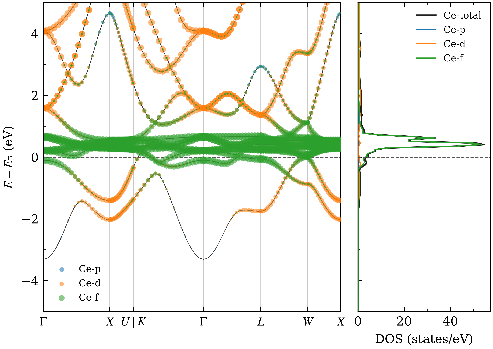
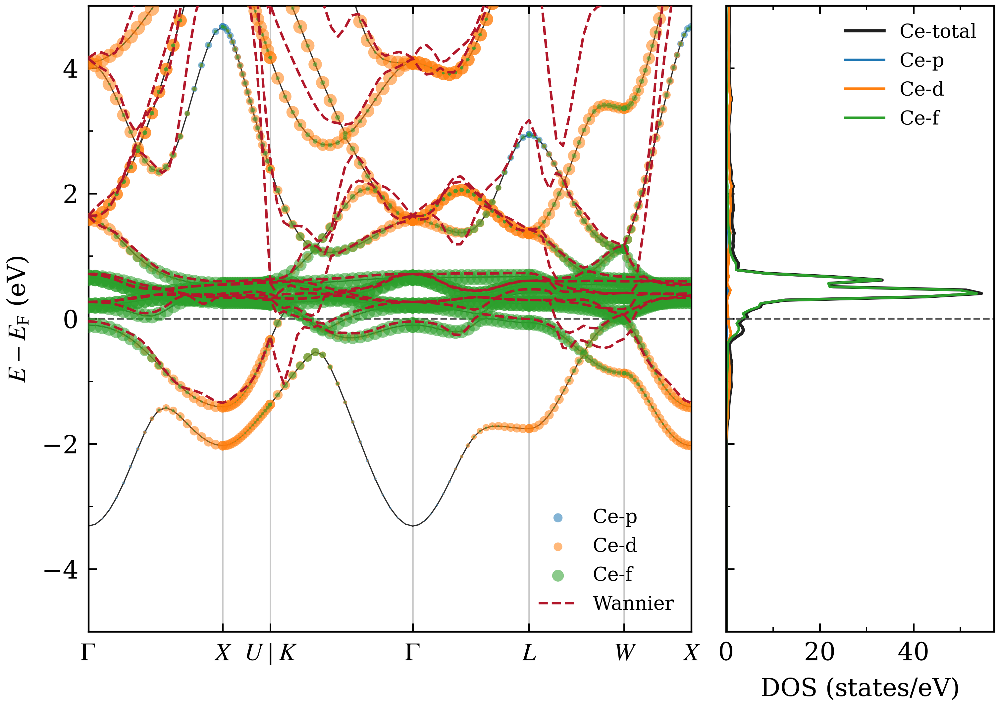
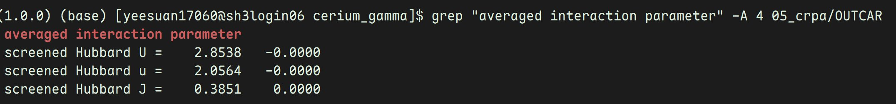

# Wannier能量窗口自动确定与cRPA计算全流程控制软件 用户手册

**软件版本：** V1.1.0（候选版本；技术项目：crpa-workflow 1.1.0）\
**文档状态：** 待审阅草稿\
**文档更新日期：** 2026年9月17日\
**适用对象：** 在 Linux 工作站或高性能计算集群上开展 VASP 计算的科研人员

本手册说明软件的安装、配置、自动选窗、阶段提交和结果查看方法。第4章以算例提供者提供的γ-Ce命令记录、配置、Wannier输入、选窗诊断和三张结果图说明操作过程，展示实际窗口数值及cRPA输出。本文中的命令、文件名和参数名保留程序中的英文写法。

[English manual / 英文手册](user_manual.md)

## 目录

1. 软件概述
2. 运行环境与安装
3. 计算目录与配置
4. γ-Ce计算操作实例
5. 命令说明
6. 能带、态密度绘图与能带排序
7. Wannier 与 cRPA 计算
8. 批量计算
9. 输入、输出与状态查询
10. 常见问题与恢复操作
11. 物理结果检查与验证范围

## 1. 软件概述

### 1.1 用途

本软件的技术项目名为 crpa-workflow，核心功能是根据目标轨道投影与能带数据自动确定 Wannier 能量窗口，并控制从前置电子结构计算、Wannier 构建到约束随机相位近似（cRPA）计算的各阶段操作。

窗口选择以用户指定的目标轨道、搜索范围与约束参数为输入，自动生成外窗口，并在满足约束时生成冻结窗口，同时保存诊断信息和 Wannier 输入。流程控制覆盖可选结构弛豫、自洽场、态密度、能带、Wannier 和 cRPA 阶段的输入准备、数据衔接、执行、作业提交及文件状态查询。

软件负责生成输入文件和作业脚本、安排阶段之间的数据传递、提交具有依赖关系的 Slurm 作业、查询基于输出文件的计算状态，以及进行轨道投影分析、Wannier 能量窗口选择和能带／态密度绘图。

电子结构计算由用户配置的 VASP 执行。VASPKIT 用于生成部分网格、能带路径、赝势组合及投影数据。使用者需要单独准备这些外部程序及其运行环境。

### 1.2 功能模块

| 功能 | 说明 |
| --- | --- |
| Wannier 能量窗口自动确定 | 按目标轨道投影、局部权重覆盖和能态数量约束选择外窗口与可行的冻结窗口，生成诊断报告 |
| 计算初始化 | 创建独立的材料计算目录和配置文件 |
| 环境检查 | 检查当前终端中可用的工具、Python 环境及部分输入条件 |
| 基础计算准备 | 生成结构弛豫、SCF、DOS 和能带阶段的输入及作业脚本 |
| 执行与提交 | 支持直接顺序执行及 Slurm 依赖作业提交 |
| 状态查询 | 根据阶段登记信息和 OUTCAR 文件报告阶段状态 |
| 投影分析与绘图 | 绘制元素或轨道投影能带与态密度，并支持 Wannier 能带叠加 |
| Wannier 准备 | 根据轨道选择和已有计算数据生成 Wannier 输入及窗口诊断 |
| cRPA 准备 | 根据完成的 Wannier 计算生成 cRPA 输入并检查目标态编号 |
| 批量处理 | 为多个结构创建独立计算目录并逐个准备、运行或提交 |

### 1.3 计算流程


执行基础 `submit` 命令时，提交范围为可选弛豫、SCF、DOS 和能带阶段。DOS 与能带均依赖 SCF，二者之间没有先后依赖。Wannier 与 cRPA 需在检查前序结果后分别准备和提交。

## 2. 运行环境与安装

### 2.1 环境要求

| 项目 | 要求或用途 |
| --- | --- |
| 操作系统 | Linux；Windows 用户可在 WSL 内安装运行，或连接远程 Linux 集群 |
| Shell | Bash 4 或更新版本，以及常用 Unix 命令行工具 |
| Python | Python 3.10 或更新版本 |
| 安装组件 | 使用安装脚本时，需要 `venv`，以及 `ensurepip` 或支持 `--python` 选项的已有 pip |
| VASP | 用户自行配置的可运行版本；应具备所需计算功能 |
| VASPKIT | 用户自行配置，并根据需要设置可用的赝势库 |
| Wannier/cRPA 支持 | VASP 构建及相关运行组件应支持拟开展的 Wannier 和 cRPA 计算 |
| Slurm | 使用 `submit` 类命令时需要；直接运行不要求安装 Slurm |
| NumPy、Matplotlib | 绘图功能依赖，可通过 `plot` 安装选项安装 |

软件不提供 VASP 可执行文件或赝势文件。安装工作流不能代替配置外部计算程序。原生 Windows 环境不支持本软件的 Bash 计算执行流程，应在 WSL 或 Linux 环境中执行。

计算所需 CPU、内存和磁盘空间取决于原子数、k 点、能带数及计算方法。应根据实际体系进行资源评估；手册示例中的资源数不代表通用的生产计算配置。

本实例在远程Linux集群测试，算例提供者确认使用VASP 6.5.1和VASPKIT 1.5.1。提供的环境检测报告记录CentOS Linux 7、Python 3.13.5、Bash 4.2.46和Slurm 19.05.7；这是检测时的会话环境，具体算例参数见第4章。开发平台为Windows、VS Code和WSL Ubuntu。

### 2.2 使用安装脚本

解压完整源码发布包，在包含 `install.sh` 的目录中执行：

```bash
bash install.sh "$HOME/.local/share/crpa-workflow/1.1.0"
source "$HOME/.local/share/crpa-workflow/1.1.0/bin/activate"
crpa-workflow --version
```

正常情况下，最后一条命令显示 `crpa-workflow 1.1.0`。安装脚本将软件及绘图依赖安装到指定的 Python 虚拟环境，不需要管理员权限，也不会自动修改 Shell 启动文件。

如果目标目录已存在，安装脚本会拒绝覆盖。升级时建议指定新的安装目录，并保留旧环境，以便已生成的批量计算启动脚本继续使用原有环境。每次打开新终端后，应重新激活环境，或使用安装目录下命令的绝对路径。

### 2.3 在已有 Python 环境中安装

在源码目录中执行：

```bash
python -m pip install '.[plot]'
```

`plot` 选项安装 NumPy 和 Matplotlib。如果只需要准备计算文件，可省略该选项：

```bash
python -m pip install .
```

开发和调试时可使用 `python -m pip install -e '.[plot]'` 安装可编辑版本。普通使用者宜安装明确版本的发布包。

### 2.4 命令名称迁移

原命令 `vasp-workflow` 和 `vasp-workflow-batch` 已分别更名为 `crpa-workflow` 和 `crpa-workflow-batch`；Python 模块名为 `crpa_workflow`，pip 包名为 `crpa-workflow`。本版本不提供旧命令别名，已有安装不会自动改名，应将新源码安装到新环境并激活。

仅命令名称迁移本身不要求修改现有计算目录、已生成的 `job.sh` 或科学计算输入。旧批量启动脚本仍引用 `vasp_workflow`，可以保留原安装环境继续使用，或在新环境中通过 `crpa-workflow --root /path/to/case COMMAND` 管理已有计算。如需获得第11章所述的独立执行修复，须重新生成已有作业脚本。旧版本 ZIP 备份保留历史名称。

### 2.5 离线安装

在与目标集群的 Python 版本、CPU 架构相匹配的联网 Linux 环境中，从源码目录准备 wheel 文件：

```bash
python -m pip wheel '.[plot]' 'setuptools>=68' -w wheelhouse
```

将 `wheelhouse` 复制到目标集群，在已具备 pip 的 Python 环境中执行：

```bash
python -m pip install --no-index --find-links wheelhouse \
  'crpa-workflow[plot]==1.1.0'
```

如果集群 Python 缺少安装所需组件，应先选择集群提供的适当 Python 环境。更多说明见[安装指南（英文）](installation.md)。

## 3. 计算目录与配置

### 3.1 创建独立计算目录

软件只需安装一次，不同材料分别使用独立目录：

```bash
crpa-workflow init my-material --poscar /path/to/POSCAR --profile slurm
cd my-material
```

将 `/path/to/POSCAR` 替换为实际输入文件路径。输入结构应采用 VASP 5 风格，元素符号位于第 6 行。创建时会生成 `workflow.conf` 和版本元数据，并在指定 `--poscar` 时复制输入结构。

初始化会拒绝覆盖已有配置、初始化元数据或待写入的 POSCAR。该命令只建立计算目录，不会直接开始 VASP 计算。计算目录无需包含程序源码。可提供已有的 `POTCAR`，或配置 VASPKIT 从适当的赝势库生成它。

`--profile` 支持两种模式：

| 模式 | 默认执行命令 | 适用场景 |
| --- | --- | --- |
| `slurm` | `srun vasp_std` | 使用 Slurm 的计算集群，也是初始化的默认模式 |
| `local` | `vasp_std` | 在适当计算环境中直接执行；可自行配置 MPI 命令 |

新建 Slurm 配置的节点数和每节点任务数均为 1，分区留空。运行前应根据集群要求调整分区、账户、任务数量及运行环境。

### 3.2 主要配置项

`workflow.conf` 采用 Bash 语法，支持变量、执行命令和完整模板。应使用可信来源的配置文件，并在修改后检查语法和参数。

| 配置项 | 作用 |
| --- | --- |
| `VASPKIT_BIN` | VASPKIT 可执行文件名或绝对路径 |
| `PYTHON_BIN` | 可选的 Python 解释器覆盖设置；通常使用安装环境的解释器 |
| `SUBMIT_COMMAND` | 作业提交命令，默认 `sbatch` |
| `EXECUTION_SETUP` | 直接执行和生成作业时使用的模块加载、环境设置命令 |
| `STAGE_COMMANDS` | 默认执行命令及可选的逐阶段执行命令 |
| `SBATCH_PARTITION` | Slurm 分区 |
| `SBATCH_NODES`、`SBATCH_NTASKS_PER_NODE` | 节点数和每节点任务数 |
| `SBATCH_CPUS_PER_TASK`、`SBATCH_TIME` | 每任务 CPU 数和时间限制 |
| `SBATCH_EXTRA` | 账户、QoS 等附加 Slurm 指令 |
| `CRPA_SBATCH_*`、`CRPA_KPAR` | cRPA 阶段的资源覆盖设置及 KPAR |
| `RUN_RELAX`、`GENERATE_BANDS` | 是否准备结构弛豫和能带阶段 |
| `ENCUT`、`ENCUT_FACTOR` | 固定平面波截断能，或根据 POTCAR 中 ENMAX 自动确定截断能的系数 |
| `KPR_RELAX`、`KPR_SCF`、`KPR_DOS`、`KPR_WANN` | 各阶段生成 k 点网格所用的分辨率参数 |
| `INCAR_*_TEMPLATE`、`SBATCH_TEMPLATE` | 各阶段完整 INCAR 模板和作业头模板 |

准备输入时需要使用的 VASPKIT 等工具应在当前终端可用。`EXECUTION_SETUP` 用于计算执行和作业脚本，不会由 `doctor` 自动执行。

### 3.3 新建计算的主要默认参数

下表对应不指定自定义配置时，由 `init` 生成的配置：

| 参数 | 默认值 |
| --- | --- |
| `ENCUT` | `auto` |
| `ENCUT_FACTOR` | `1.50` |
| `EDIFF`、`EDIFFG` | `1e-6`、`-0.02` |
| `ISIF`、`NSW` | `3`、`200` |
| `KPR_RELAX` | `0.03` |
| `KPR_SCF`、`KPR_DOS` | `0.02`、`0.02` |
| `KPR_WANN` | `0.04` |
| `NEDOS` | `2000` |
| `RUN_RELAX`、`GENERATE_BANDS` | `yes`、`yes` |

`ENCUT=auto` 时，程序取 POTCAR 中最大的 ENMAX，乘以 `ENCUT_FACTOR`，再向上取整到 5 eV 的整数倍。这些默认值沿用当前研究配置的部分选择，使用者仍需为具体体系检查收敛性。

### 3.4 配置选择顺序

一般操作命令依次按以下顺序选择配置文件：

1. 命令行显式指定的 `--config FILE`。
2. 环境变量 `WORKFLOW_CONFIG` 指定的文件。
3. 计算目录中的 `workflow.conf`。

显式指定的文件会替代计算目录配置，不是与它叠加合并。所选配置中的赋值会覆盖同名环境变量；配置未设置的变量保留继承的环境值（若有），否则采用后端的历史回退默认值，可能与上表的新建配置不同。更多说明见[安装指南（英文）](installation.md)。

`init` 的行为有所区别：指定全局 `--config FILE` 时原样复制该配置，不再追加 local/slurm 默认配置；未指定时使用随软件提供的默认配置及所选 profile。初始化不从 `WORKFLOW_CONFIG` 获取配置。

### 3.5 硅结构输入演示

随软件提供的 `examples/silicon/POSCAR` 含两个 Si 原子，用于演示输入格式，不是已验证的参考计算。在源码目录中创建独立的硅计算目录：

```bash
crpa-workflow init silicon --poscar examples/silicon/POSCAR --profile slurm
cd silicon
# 根据集群和计算需求编辑 workflow.conf。
crpa-workflow doctor prepare
crpa-workflow prepare --no-relax
crpa-workflow doctor submit
crpa-workflow submit --job-name silicon
crpa-workflow status
```

上述操作使用提供的结构准备 `01_scf`、`02_dos` 和 `03_band`。如需结构弛豫，省略 `--no-relax` 并保持 `RUN_RELAX=yes`；SCF 随后使用弛豫完成的 `CONTCAR`，DOS 和能带使用 SCF 电荷密度。Slurm 采用 `afterok` 依赖：弛豫 → SCF → DOS/能带。

直接执行时，初始化采用 `--profile local`，配置执行命令，并在准备后使用 `crpa-workflow run`。直接执行按顺序运行并占用当前会话，应遵守集群关于计算运行位置的规定。

第6至7章中的 Si 绘图及 Wannier/cRPA 命令针对这个独立算例，应在所需前序计算完成并检查结果后执行。第4章使用 γ-Ce，轨道和目标态选择与硅算例不同。

## 4. γ-Ce计算操作实例

### 4.1 实例准备与配置

本章依据算例提供者提供的γ-Ce算例材料编写，包含命令记录、配置、Wannier阶段INCAR、自动选窗诊断、两张能带/DOS图及cRPA结果截图。下列命令按当前软件接口整理，不作为原始终端执行日志。

使用者先准备实际γ-Ce结构文件，按第3.1节初始化独立目录，并配置集群环境。以下`/path/to/gamma-Ce`表示实际计算根目录；仅含图表和命令记录的材料目录不能直接作为完整计算目录运行。

```bash
cd /path/to/gamma-Ce
crpa-workflow --version
crpa-workflow doctor prepare
```

提供的配置包含以下设置；这些是本案例的作业请求和输入设置，实际分配节点及计算结果仍以作业记录为准。

| 项目 | 本案例配置 |
| --- | --- |
| Slurm分区 | `q_ysuan_384` |
| 节点和任务 | 4节点，每节点56任务，每任务1 CPU；请求总任务数224 |
| 时间限制 | `24:00:00` |
| 最终执行命令 | `mpirun -np "$SLURM_NTASKS" vasp_std` |
| 环境载入 | 在`SBATCH_TEMPLATE`中载入VASP环境脚本；路径应按实际集群配置 |
| 截断能 | 配置为`ENCUT=auto`、`ENCUT_FACTOR=1.50`；提供的Wannier INCAR中`ENCUT=410` eV |
| SCF与DOS网格设置 | `KPR_SCF=0.02`，`KPR_DOS=0.02` |
| Wannier网格设置 | `KPR_WANN=0.04` |
| 电子收敛与DOS采样 | `EDIFF=1e-6`，`NEDOS=2000` |
| cRPA资源 | 继承上述Slurm设置，`CRPA_KPAR=4` |

`workflow.conf`末尾对默认执行命令再次赋值，该赋值覆盖前面的`vasp_std`。本配置依赖Slurm提供`SLURM_NTASKS`，且环境载入位于作业脚本模板中，因此本章采用`submit`类命令。准备和绘图前，当前终端也应能找到VASPKIT；作业脚本内的环境设置不会自动作用于这些本地准备命令。

### 4.2 准备并提交基础阶段

```bash
crpa-workflow prepare --no-relax
crpa-workflow doctor submit
crpa-workflow submit --job-name Ce
crpa-workflow status
```

本例显式使用`--no-relax`，跳过结构弛豫，即使配置中`RUN_RELAX=yes`也不准备该阶段。准备后检查`01_scf`、`02_dos`和`03_band`中的输入及`job.sh`；提交时DOS和能带分别依赖SCF成功结束。等待各阶段完成并检查输出后再绘图。`status`显示的是文件状态，排队和运行情况应同时查看Slurm作业记录。

### 4.3 查看Ce轨道投影能带与态密度

```bash
crpa-workflow postprocess --orbital-element Ce --orbitals p d f
```

本命令展示Ce的p、d、f轨道分量，默认输出`projected_band_dos.png`和同名PDF。图1左侧为投影能带，右侧为总态密度和轨道分辨态密度，纵轴统一为相对费米能`E-E_F`。p、d、f投影分别使用蓝色、橙色和绿色标记；能带标记面积用于表示投影权重。



图中费米能附近可见较明显的Ce-f投影；读者可据轨道特征选择拟研究子空间。绘图中的`p d f`用于展示，下一步Wannier输入中的`f d`用于构建投影子空间，两者用途不同。

### 4.4 自动选窗及Wannier构建

SCF和DOS完成、所需输入齐备后，在同一计算根目录执行：

```bash
crpa-workflow prepare-wannier --elements Ce Ce --orbitals f d
```

该选择按位置配对为`Ce:f`、`Ce:d`。本例诊断记录使用`adaptive`方法，搜索范围为相对SCF费米能的`-20`至`20` eV，外窗口覆盖比例为`0.8`，冻结轨道特征阈值为`0.70`，边界余量为`0.1` eV，与当前版本默认参数一致。

程序读取SCF投影及DOS能量数据，自动选择外窗口和可行的冻结窗口，将结果写入`04_wann/INCAR`的`WANNIER90_WIN`部分，并生成`04_wann/wannier_window_diagnostics.json`。检查方法及字段见第7.1节；此处不要求手工试填四个能量边界。

本例SCF费米能为`6.8158` eV。诊断文件的四个绝对窗口端点与提供的INCAR一致，且满足“绝对能量＝相对能量＋费米能”：

| 窗口 | 相对费米能的下限/上限（eV） | 写入INCAR的下限/上限（eV） |
| --- | --- | --- |
| 外窗口 | `-1.5000 / 19.7500` | `5.3158 / 26.5658` |
| 冻结窗口 | `-0.4000 / 1.9000` | `6.4158 / 8.7158` |

提供的INCAR设定`NUM_WANN=12`、`NBANDS=112`。诊断中外窗口的最少能态数为17，不小于12；冻结窗口的能态数范围为7至10。Ce:f和Ce:d的最低局部覆盖比例分别约为93.36%和85.70%，`warnings`为空。该诊断只检查提供的SCF/DOS网格，尚不能据此认定新Wannier网格或插值误差已经收敛。

本例Wannier输入包含`num_iter=0`和`dis_num_iter=1000`：前者不进行最大局域化迭代，后者设置解缠迭代次数。因此本例以投影Wannier构建及能带比较展示功能，不表述为最大局域化迭代已收敛。参数含义参见[Wannier90用户指南](https://github.com/wannier-developers/wannier90/blob/develop/docs/docs/user_guide/wannier90/parameters.md)。

确认输入和选窗诊断后，提交Wannier阶段：

```bash
crpa-workflow submit-wannier --job-name Ce
```

原命令记录为`run-wannier --job-name Ce`，当前接口的`run-wannier`不接受附加参数。本章改用与案例Slurm配置一致的`submit-wannier --job-name Ce`；如果在已分配的计算资源中直接执行，应先确保环境和执行命令适用，再使用不带参数的`crpa-workflow run-wannier`。

Wannier计算完成并生成插值能带后执行：

```bash
crpa-workflow postprocess --wannier-bands --orbital-element Ce \
  --orbitals p d f --output wannier
```

该命令在投影能带上叠加Wannier插值能带，输出`wannier.png`和同名PDF。图2中红色虚线为Wannier能带，可与原始能带逐段比较。



图中若干分支存在可见偏差。检查时应结合选定子空间、目标能区和实际窗口判断插值质量；本图用于展示软件叠加比较功能，不能代替误差统计或收敛检查。

### 4.5 准备并提交cRPA

Wannier阶段完成且前序文件检查通过后执行：

```bash
crpa-workflow prepare-crpa --target-states 1-7
crpa-workflow submit-crpa --job-name Ce
crpa-workflow status
```

`1-7`来自本例命令记录，表示12个Wannier函数中的第1至第7个态；输入中投影顺序为`Ce:f`、`Ce:d`。实际使用时应结合结构、投影定义和生成的基组顺序核对目标态的物理含义，不把编号范围直接照搬到其他材料。

原记录最后一条`submit-crpa --job-name`缺少前缀，本章补为`Ce`。提交后查看`05_crpa/job.sh`、`INCAR`和实际输出。可用以下只读命令定位结果：

```bash
grep -A 4 "averaged interaction parameter" 05_crpa/OUTCAR
```



截图中的三行结果抄录如下，保留原标签大小写和两列数值；小写`u`与大写`U`分开记录，不将其改写成其他参数名称。

| 输出标签 | 第一数值列 | 第二数值列 |
| --- | --- | --- |
| `screened Hubbard U` | `2.8538` | `-0.0000` |
| `screened Hubbard u` | `2.0564` | `-0.0000` |
| `screened Hubbard J` | `0.3851` | `0.0000` |

上述数值来自算例提供者提供的终端截图，用于说明结果读取方式。完整OUTCAR、频率设置及参数收敛记录未随本轮材料提供；不据该截图片段断言所有收敛条件均已满足。`status`的完成标记仍需结合计算日志判断。

### 4.6 操作检查要点

| 操作节点 | 查看内容 | 后续操作 |
| --- | --- | --- |
| 基础计算准备后 | 各阶段INCAR、KPOINTS、POTCAR及job.sh | 确认配置后提交 |
| SCF、DOS、能带完成后 | 输出文件、作业状态及图1 | 核对轨道后准备Wannier |
| 自动选窗后 | 窗口诊断、NUM_WANN及WANNIER90_WIN | 处理警告后提交Wannier |
| Wannier完成后 | 重启文件、插值输出及图2 | 核对基组及目标态编号 |
| cRPA准备后 | NTARGET_STATES、NBANDSGW、ENCUTGW及资源 | 确认后提交cRPA并检查结果 |

`submit-wannier`和`submit-crpa`不会自动等待前序作业。每一步均应在所需前序阶段完成后执行；重复准备已存在的阶段前先检查已有结果，避免盲目使用`--force`。

## 5. 命令说明

### 5.1 全局选项

默认操作当前目录。选择其他计算目录或配置时，全局选项必须位于子命令之前：

```bash
crpa-workflow --root /path/to/case --config /path/to/custom.conf prepare
```

`--root` 表示计算目录，`--config` 表示配置文件；子命令自身的参数放在子命令之后。

### 5.2 命令总览

| 命令 | 功能与主要参数 |
| --- | --- |
| `--help`、`--version` | 显示命令入口帮助或软件版本 |
| `init DIR --poscar FILE --profile slurm` | 初始化计算；profile 也可选 `local` |
| `doctor prepare` | 检查准备计算所需的基本环境；默认检查模式 |
| `doctor plot` | 检查绘图相关工具及 NumPy、Matplotlib |
| `doctor submit` | 检查 Slurm 提交命令和基本资源数量 |
| `doctor run` | 检查直接执行的基础工具并显示配置的执行命令 |
| `prepare [--no-relax] [--force]` | 生成基础计算输入和作业脚本 |
| `run` | 顺序执行已准备的基础阶段 |
| `submit [--job-name PREFIX]` | 提交基础 Slurm 依赖流程 |
| `execute STAGE` | 直接执行指定的已准备阶段，例如 `01_scf` |
| `status` | 查询已登记阶段的文件状态 |
| `postprocess [OPTIONS]` | 绘制投影能带和态密度 |
| `rank-bands --elements E... --orbitals O...` | 根据轨道投影权重排序能带 |
| `prepare-wannier [OPTIONS]` | 准备 `04_wann` |
| `run-wannier`、`submit-wannier` | 直接执行或提交 Wannier 阶段 |
| `prepare-crpa [OPTIONS]` | 准备 `05_crpa` |
| `run-crpa`、`submit-crpa` | 直接执行或提交 cRPA 阶段 |
| `batch [OPTIONS] STRUCTURE_DIR [CALCULATION_DIR]` | 批量准备、运行或提交多个结构 |

`doctor` 不执行 VASP、VASPKIT 或 Slurm 作业，也不执行配置中的环境加载命令。检查通过表示当前终端满足其检查范围，不能据此确认计算节点环境、赝势库或物理结果正确。更多选项见[命令速查（英文）](quickstart.md)及各命令的 `--help`。

### 5.3 提交与独立作业脚本

`submit`、`submit-wannier` 和 `submit-crpa` 支持 `--job-name PREFIX`，也支持 `--job-name=PREFIX`。软件会为名称追加对应阶段标识。

重复提交会查询 `squeue`/`sacct`，复用已记录且仍有效的排队、运行或成功完成作业，仅补交缺失阶段。需要重新计算时使用 `--resubmit`，前提是本算例所有已记录作业均已结束。状态未知或提交结果不明确时会停止提交。直接使用 `sbatch` 或更新前提交的作业不在追踪范围内。详见[提交恢复与迁移说明](quickstart.md#submission-retries-and-environment-setup)。

生成的各阶段 `job.sh` 为独立脚本，可在对应目录中直接提交：

```bash
cd 01_scf
sbatch job.sh
```

独立提交时，应自行确认前序数据已准备好，或显式设置调度依赖。修改 `workflow.conf` 不会自动修改已生成的作业脚本；应在适当时机重新生成输入和作业。不要在作业运行过程中替换其输入文件。

## 6. 能带、态密度绘图与能带排序

### 6.1 元素投影绘图

第3.5节的硅算例在 DOS 和能带阶段完成后，可执行：

```bash
crpa-workflow postprocess --elements Si --emin -5 --emax 5
```

`--emin`、`--emax` 设置绘图能量范围，单位为 eV。可以重复指定 `--format` 输出多种格式：

```bash
crpa-workflow postprocess --elements Mn Sb --emin -4 --emax 4 \
  --format png --format pdf --format svg --title "Mn-Sb"
```

请将元素符号替换为实际体系中的元素。默认输出文件基名为 `projected_band_dos`；可使用 `--output` 修改。已有合适的 PBAND/PDOS 数据时，可使用 `--reuse-data` 跳过 VASPKIT 数据生成。

### 6.2 轨道分辨绘图与 Wannier 能带叠加

例如，对含 Ni 的体系选择轨道分量：

```bash
crpa-workflow postprocess --orbital-element Ni --orbitals dz2 dx2-y2
```

完成 Wannier 计算并具备对应能带文件后，可用 `--wannier-bands` 叠加 Wannier 插值能带：

```bash
crpa-workflow postprocess --elements Si --wannier-bands
```

应检查参考能量对齐、插值能带与原始能带的一致性。完整绘图选项可通过 `crpa-workflow postprocess --help` 查看。

### 6.3 能带排序

以下命令读取 SCF 轨道投影，并结合 DOS 阶段能量信息生成排序结果：

```bash
crpa-workflow rank-bands --elements Mn Sb --orbitals d p --csv band_ranking.csv
```

该排序命令会组合选定元素及壳层的投影；它与 `prepare-wannier` 中按位置配对的元素／轨道选择规则不同。可用 `--scf-directory`、`--dos-directory` 指定数据目录，用 `--num-bands` 限制输出的高权重能带数量。详细说明见 `crpa-workflow rank-bands --help`。

## 7. Wannier 与 cRPA 计算

### 7.1 Wannier 输入准备

对第3.5节的硅算例，在 SCF、DOS 以及所需的能带计算完成并检查结果后执行：

```bash
crpa-workflow prepare-wannier --elements Si Si --orbitals s p
```

这里元素和轨道按位置配对，表示 `Si:s` 和 `Si:p`。默认 Wannier 函数数量根据相应元素原子数和壳层简并度推断，其中 `s=1`、`p=3`、`d=5`、`f=7`；可使用 `--num-bands` 覆盖默认数量。目标子空间应根据研究问题确定。

主要窗口选项如下：

| 选项 | 默认值与含义 |
| --- | --- |
| `--window-method` | `adaptive`；可选 `legacy` 使用旧窗口公式 |
| `--search-energy-range MIN MAX` | `-20 20`，相对于 SCF 费米能的搜索区间，单位 eV |
| `--outer-coverage` | `0.8`，外窗口局部投影权重的中心覆盖比例 |
| `--frozen-character-min` | `0.70`，冻结窗口的目标轨道特征阈值 |
| `--frozen-margin` | `0.1` eV，冻结窗口向内缩进的边界余量 |
| `--kpr` | 默认来自 `KPR_WANN`，控制 Wannier 网格生成 |
| `--force` | 有意重新生成已存在的工作流阶段 |

SCF 费米能必须为有限数值，搜索区间必须具有有限且满足 `MIN < MAX` 的端点。窗口不要求包含费米能。如果没有符合条件的冻结窗口，程序可能生成只有外窗口的输入，并在诊断文件中说明原因。

自动选择的处理顺序如下：

1. 以 SCF 费米能为统一参考，读取目标元素和轨道的投影权重，并限定搜索能量范围。
2. 对各目标轨道对、k 点和自旋的非零投影分布求等尾分位区间，将其包络作为外窗口的基础范围。
3. 在能量网格上选择覆盖该范围的外窗口，检查所提供的 SCF/DOS 各采样点内能态数均不少于 Wannier 函数数量；必要时扩大窗口，无可行解时报错。
4. 在外窗口内搜索冻结窗口，检查目标轨道特征阈值、能态数量、自旋非空及边界余量约束，并优先选择目标投影权重较高的候选区间。
5. 写入窗口参数和诊断信息；无可行冻结窗口时记录原因，保留外窗口。

例如，可明确指定自适应方法和搜索约束：

```bash
crpa-workflow prepare-wannier --elements Si Si --orbitals s p \
  --window-method adaptive --search-energy-range -20 20 \
  --outer-coverage 0.8 --frozen-character-min 0.70 --frozen-margin 0.1
```

上述数值为参数示例。运行后应核对诊断文件中的外窗口和冻结窗口、各轨道对覆盖情况、限制能态数量的位置及警告，确认其对应所选物理子空间。投影权重用于轨道特征估计；窗口可行性检查针对已提供的 SCF/DOS 网格，仍需通过实际 Wannier 计算检查插值质量。

准备后应查看：

```text
04_wann/INCAR
04_wann/wannier_window_diagnostics.json
```

对于`adaptive`方法，诊断报告的主要字段及检查方式如下：

| 字段 | 含义与检查方式 |
| --- | --- |
| `projection_pairs`、`num_wann` | 核对目标轨道配对和实际Wannier函数数量 |
| `fermi_energy` | 用于相对与绝对能量换算的SCF费米能 |
| `windows_relative.outer`、`windows_relative.frozen` | 相对费米能的外窗口、冻结窗口；单位eV |
| `windows_absolute.outer`、`windows_absolute.frozen` | 对应写入Wannier输入的绝对能量边界；单位eV |
| `outer_counts` | 检查所提供网格上外窗口内的能态数量限制 |
| `coverage_by_pair` | 检查各目标轨道对的投影权重覆盖情况 |
| `outer_only_reason` | 无可行冻结窗口时的原因；冻结窗口为`null`时不应填成0 eV |
| `warnings`、`validation_scope` | 查看边界、能带范围或覆盖警告及验证范围 |

可用`python -m json.tool 04_wann/wannier_window_diagnostics.json`在终端查看报告。核对`INCAR`中的`dis_win_min/max`和存在时的`dis_froz_min/max`与绝对窗口一致；不要把图中相对费米能的读数直接作为绝对输入。γ-Ce实例的核对结果见第4.4节。

确认目标轨道、函数数量、窗口和输入设置后，再运行或提交：

```bash
crpa-workflow submit-wannier --job-name silicon
# 直接执行环境可改用 crpa-workflow run-wannier。
```

### 7.2 cRPA 输入准备

等待 Wannier 计算完成，检查局域化及插值结果，并确认重启文件齐备后执行：

```bash
crpa-workflow prepare-crpa --target-states 1-8
crpa-workflow submit-crpa --job-name silicon
```

`1-8` 仅用于第3.5节初始化的双原子 Si、s/p 子空间示例中推断出的八个 Wannier 函数。实际目标态范围应根据实际基组和物理问题选择。

不指定 `--target-states` 时，默认选择全部 Wannier 态。参数支持从 1 开始的单个编号和包含端点的编号范围，例如 `1-5 8 10-12`，所选编号必须在实际 Wannier 基组范围内。

| 选项 | 作用 |
| --- | --- |
| `--target-states` | 指定从屏蔽通道中排除的目标 Wannier 态编号 |
| `--nbandsgw` | 覆盖 NBANDSGW；默认使用完成的 Wannier 计算的有效能带数 |
| `--encutgw` | 覆盖响应函数截断能；默认是平面波截断能的三分之二 |
| `--kpar` | 覆盖 cRPA KPAR；工作流默认传入配置中的 `CRPA_KPAR` |
| `--force` | 有意重新生成已存在的 cRPA 阶段 |

`submit-wannier` 和 `submit-crpa` 不会自动添加与前序作业之间的调度依赖，应在前序阶段完成后使用。直接运行时分别使用 `run-wannier`、`run-crpa`。

## 8. 批量计算

### 8.1 输入组织

支持以下结构文件组织形式：

```text
structures/
├── POSCAR_materialA.vasp
└── materialB/
    └── POSCAR
```

程序识别 `POSCAR*`、`*.vasp`、`*.poscar` 等文件，并为每个结构生成独立计算目录。建议先检查输入到输出的目录映射：

```bash
crpa-workflow --config /path/to/workflow.conf batch \
  --dry-run --mode prepare /path/to/structures /path/to/calculations
```

预演只列出目录映射，不创建计算目录。

### 8.2 准备与提交

确认映射和配置后，先生成输入用于审阅：

```bash
crpa-workflow --config /path/to/workflow.conf batch \
  --mode prepare /path/to/structures /path/to/calculations
```

批量模式默认是 `submit`，会准备并提交计算；使用 `--mode prepare` 可仅准备文件。`--mode run` 为直接执行，`--no-relax` 可跳过弛豫。

每个计算目录包含 POSCAR、配置副本、版本记录、生成的阶段目录，以及一个调用安装环境的 `workflow.sh` 启动脚本。这个按计算生成的脚本仍然有效，与已归档的旧根目录脚本不同。

仅当 `.batch-workflow-state` 记录请求的操作已经完成时，已有目录才会被成功跳过。未完成或缺少状态记录的旧算例计为失败。`--force` 可刷新带有批量标识且没有提交记录的算例；POSCAR 已改变、缺少所有权标识或存在提交记录时会拒绝刷新。批量运行会继续处理其他结构，最后输出已准备、已完成、跳过和失败数量；只要有失败，命令就返回非零退出码。提交操作完成仅表示 Slurm 已接受作业，不代表计算结束。

如果先采用 `--mode prepare`，审阅后可进入各计算目录执行 `crpa-workflow submit`。再次执行默认批量提交命令时，已准备但尚未提交的算例会报告未完成；不应仅为提交已有作业而使用 `--force`。

批量目录的启动脚本指向创建它的安装环境。应保留该环境，或激活其他明确版本后使用 `crpa-workflow --root /path/to/case status` 等命令管理已有计算。

## 9. 输入、输出与状态查询

### 9.1 文件和目录说明

| 位置或文件 | 主要用途 |
| --- | --- |
| `POSCAR` | 输入结构 |
| `POTCAR` | 用户提供或通过 VASPKIT 生成的赝势组合 |
| `workflow.conf` | 本计算的执行环境、资源、科学参数和模板 |
| `.workflow-release.json` | 初始化时的软件版本和配置哈希等元数据 |
| `.workflow-version` | 批量创建时记录的软件版本 |
| `.workflow-stages` | 工作流登记的阶段列表 |
| `00_relax/` | 弛豫输入和输出，CONTCAR 用于后续 SCF |
| `01_scf/` | SCF 输入和输出，包括 CHGCAR、PROCAR、OUTCAR 等 |
| `02_dos/` | DOS 输入和输出，包括 EIGENVAL、DOSCAR 等 |
| `03_band/` | 能带路径、能量及投影数据 |
| `04_wann/` | Wannier 输入、诊断、重启数据和计算输出 |
| `05_crpa/` | cRPA 输入、重启数据和相互作用计算输出 |
| `projected_band_dos.*` | 默认名称的投影能带和态密度图 |

创建时的版本记录不代表之后每一次参数修改或软件切换。保存研究结果时，应同时保留实际使用的配置、输入文件和作业脚本。

### 9.2 状态含义

执行 `crpa-workflow status` 后，已登记阶段可能显示：

| 状态 | 判定依据 |
| --- | --- |
| `prepared` | 阶段已登记，尚未检测到用于判定启动的非空 OUTCAR |
| `started` | 检测到非空 OUTCAR |
| `finished` | OUTCAR 中检测到预期的 VASP 计时／统计结束标记 |

状态查询不会访问 Slurm 队列，也不会验证能量、力、应力或物理结果的收敛性。排队、正在运行和作业失败等情况应结合调度系统、标准输出和错误日志判断。

## 10. 常见问题与恢复操作

| 问题 | 检查与处理方式 |
| --- | --- |
| 找不到 `crpa-workflow` | 激活安装环境，或使用命令的完整路径 |
| 安装提示缺少 venv、ensurepip 或 pip | 选择具备相应组件的集群 Python 环境 |
| 提示缺少 NumPy 或 Matplotlib | 在实际使用的解释器环境中安装 `plot` 依赖 |
| 找不到 POSCAR | 检查 `--root` 和文件位置，确认结构文件非空且格式正确 |
| 找不到 VASPKIT | 在当前终端加载模块，或正确设置 `VASPKIT_BIN` |
| POTCAR 生成失败 | 检查元素符号、赝势库配置及可访问性 |
| Slurm 提交失败 | 检查分区、账户、资源额度、提交命令及错误输出 |
| 缺少前序 CHGCAR 或 CONTCAR | 确认前序阶段完成，并检查其日志和输出 |
| 阶段目录已存在 | 先确认已有计算用途，再选择新目录或有意使用 `--force` |
| Wannier 窗口选择失败 | 检查上游数据、轨道配对、能带数及诊断信息 |
| cRPA 目标态编号不合法 | 使用实际 Wannier 基组范围内的编号 |
| 修改配置后已有作业仍使用旧设置 | 已生成脚本保留生成时的设置；在适当时机重新生成 |
| 批量启动脚本引用的环境已删除 | 激活所需版本，使用 `crpa-workflow --root CASE` 管理计算 |

重新生成前应保留需要的研究结果。软件没有适用于所有失败类型的自动重启或自动收敛恢复功能。应先确定 VASP 失败原因，再依据阶段特性选择合理的重启文件和参数。

旧版本原始代码、集群配置及已移除的根目录文件已保存在本地 `archive/legacy-files-1.4.zip`，新源码发布包不包含该本地备份。日常使用应采用安装后的 `crpa-workflow` 命令。

## 11. 物理结果检查与验证范围

使用者应根据研究任务检查：

1. 结构弛豫是否收敛，力、应力及结构变化是否合理。
2. 电子迭代、平面波截断能和 k 点网格是否达到所需精度。
3. 所选轨道投影及目标子空间是否适合物理问题。
4. Wannier 函数展宽、局域化和能带插值是否可靠。
5. cRPA 的能带数、响应函数截断能及其他参数是否收敛。

窗口准备时的检查针对所提供的 SCF/DOS 网格，不能替代实际 Wannier 网格、局域化、插值质量和 cRPA 收敛检查。作业正常结束也不能单独证明物理结果可靠。

当前候选版本已通过记录在案的 Python 测试、模拟外部程序的 Bash 工作流测试、安装检查及合成数据绘图检查。这些测试没有运行真实 VASP/Wannier/cRPA 生产计算。

算例提供者于2026年9月15日确认γ-Ce全流程测试通过，使用VASP 6.5.1与VASPKIT 1.5.1；9月16日提供命令记录、配置、Wannier输入、选窗诊断及第4章三张结果图。已核对窗口端点与输入一致，并抄录cRPA截图中的结果。尚未核验完整计算日志、结构、收敛序列及测试版本对应关系，不将已有图示视为全能区插值误差或所有收敛条件达标的证明。

随软件提供的硅 POSCAR 用于输入演示；绘图测试数据属于合成测试数据，不应作为真实材料计算结果引用。记录在案的自动化测试环境与范围见[验证记录（英文）](validation.md)，计算原理见[物理说明（英文）](physics_reference.md)。

开展生产计算验证时，应保存完整算例的终端记录和图表，包括安装与版本、配置、准备、提交与状态、投影能带与态密度、Wannier 诊断及 cRPA 输出，同时记录集群、软件及构建版本和实际计算参数。

### 执行与恢复规则（2026年9月12日修复）

生成的作业应在阶段目录中提交：`cd STAGE && sbatch job.sh`。Slurm 暂存脚本通过 `SLURM_SUBMIT_DIR` 定位阶段，并检查工作流标记；直接用 Bash 执行时按脚本所在目录定位。升级软件后须重新生成已有 job.sh，旧脚本不会自动更新。

运行命令的 `--help` 只显示帮助，不启动计算；未知参数报错。环境初始化与运行命令在非登录子 Shell 中使用 `set -euo pipefail`，建议通过 `EXECUTION_SETUP` 显式加载环境。旧配置中位于 `SBATCH_TEMPLATE` 的初始化也会检查失败，所有 Slurm 指令必须位于可执行代码之前。初始化、普通命令或管道失败会中止后续命令。自定义脚本若显式处理或忽略错误，仍需自行保证返回状态正确。

后处理使用配置中的 `VASPKIT_BIN`，命令行 `--vaspkit` 优先。Wannier 强制替换失败时恢复旧阶段；若文件系统同时阻止恢复，旧数据保留在准备临时目录的 `previous-04_wann` 中，恢复前不要删除。成功强制替换仍会移除旧 Wannier 输出。

cRPA 准备支持 VASP 文档所述的空白分隔文本 WANPROJ，不读取 HDF5 表示。程序对照 INCAR／有效 OUTCAR NBANDS 核对维度，并检查 OUTCAR 中存在的 NKPTS、k 点表、全部自旋/k 点块、完整能带／轨道索引覆盖和有限数值；不据此证明矩阵正交性、输入物理兼容性或计算收敛。格式依据：[VASP WANPROJ 文档](https://vasp.at/wiki/WANPROJ)。
